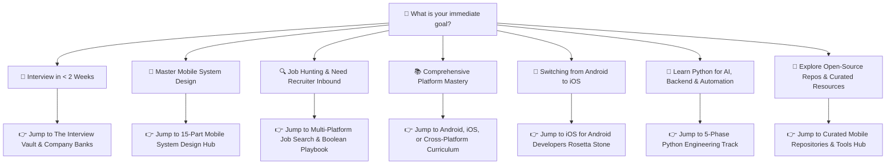

# 📱 Awesome Mobile Interviews & Engineering Handbook
> **The definitive open-source engineering handbook, distributed system design vault, and interview playbook for Android, iOS, Flutter, and React Native developers worldwide.**


<div align="center">

[](https://awesome.re)
[](https://opensource.org/licenses/MIT)
[](https://github.com/vennamprasad/awesome-mobile-interviews/stargazers)
[](https://github.com/vennamprasad/awesome-mobile-interviews/network/members)
[](https://github.com/sponsors/vennamprasad)
[](https://buymeacoffee.com/prasadvennam)
[](./CONTRIBUTING.md)

**[🎯 Choose Your Goal](#-where-to-start-choose-your-immediate-goal)** • 
**[🚦 Experience Paths](#-navigation-by-experience-level--difficulty)** • 
**[📐 System Design](./engineering/system-design/README.md)** • 
**[🐍 Python Track](./engineering/python/README.md)** • 
**[🌟 Curated Repos & Resources](./resources/README.md)** • 
**[🏢 200+ Company Banks](./interviews/README.md)** • 
**[💖 Sponsor](#-sponsoring--supporting-the-handbook)** • 
**[🤝 Contribute](./CONTRIBUTING.md)**

</div>

---

### 💡 Why Mobile Engineers Star & Bookmark This Handbook
* **⏱️ Understand the Value in 10 Seconds:** No 1,000-page bloated PDFs or paywalls. Every topic is distilled into crisp architectural answers, real code snippets, and production war-stories.
* **🎯 Calibrated by Experience Level:** Clear distinction between what is expected from a **Junior (0–3 yrs)**, **Mid-Level (3–6 yrs)**, and **Senior/Staff (6+ yrs)** engineer.
* **📐 Distributed Mobile System Design:** Master real-world client-server architectures with interactive Mermaid diagrams (Offline-First Sync, Live Telemetry, Feed Pagination, Video Streaming).
* **🐍 Full Python Engineering Track:** 5-phase learning curve from language mechanics & GIL to FastAPI microservices, on-device AI model export (CoreML/TFLite), and mobile automation.
* **🌟 Curated Production Repos & Resources:** Comprehensive directory of the best open-source Android, iOS, and Cross-Platform repositories, podcasts, and engineering blogs.
* **🏢 200+ Verified Company Question Banks:** Real interview questions asked at FAANG, global unicorns (Uber, Spotify, Stripe, OpenAI), and 60+ Indian product powerhouses.

---

### ⚡ Quick Glance: The Repository in Numbers

| 📱 4 Stacks | 🐍 Python Track | 🏢 200+ Companies | 📐 15+ System Designs | 🌟 Curated Hub | 💯 100% Free |
| :---: | :---: | :---: | :---: | :---: | :---: |
| **Android • iOS • Flutter • React Native** | **FastAPI • On-Device ML • Automation** | **FAANG, Unicorns & Consultancies** | **WhatsApp, Uber, Instagram, E-Commerce** | **Top Open-Source Repos & Blogs** | **Open Source & Community Driven** |

---

## 🎯 Where to Start? (Choose Your Immediate Goal)

Select the path that matches what you need today:



1. **🚀 "I have an upcoming technical interview in less than 2 weeks"**  
   $\rightarrow$ Jump straight to the **[Interview Vault](./interviews/README.md)**, review the **[Company Question Banks](./interviews/product-based/README.md)** (Google, Apple, Meta, Uber, Swiggy, Flipkart), and read the **[Indian Product Companies Playbook](./interviews/product-based/Indian_Product_Companies_Guide.md)**.
2. **📐 "I need to master Mobile System Design & Architecture"**  
   $\rightarrow$ Deep dive into the **[15-Part Distributed Mobile System Design Hub](./engineering/system-design/README.md)** covering WhatsApp offline messaging, Uber live location, Instagram feeds, and Server-Driven UI (SDUI).
3. **🔍 "I am actively job hunting and want more recruiter callbacks"**  
   $\rightarrow$ Use the **[Multi-Platform Job Search & Application Playbook](./interviews/02_Job_Search_Strategy.md)** to copy high-yield LinkedIn Boolean queries, Google X-Ray strings, and ATS-optimized resume templates.
4. **📚 "I want a structured, end-to-end curriculum from scratch"**  
   $\rightarrow$ Follow the sequentially numbered tracks: **[Android Mastery (19 Chapters)](./platforms/android/README.md)**, **[iOS Mastery (12 Chapters)](./platforms/ios/README.md)**, or **[Cross-Platform Track](./platforms/cross-platform/README.md)**.
5. **🌉 "I know Android and need to learn iOS fast (or vice-versa)"**  
   $\rightarrow$ Read **[The Rosetta Stone Mental Model Bridge](./platforms/ios/iOS_for_Android_Developers_Rosetta_Stone.md)** (Compose vs SwiftUI, Coroutines vs Actors, Room vs SwiftData, JVM GC vs ARC).
6. **🐍 "I want to master Python for AI, Backend APIs, or Automation"**  
   $\rightarrow$ Follow the **[5-Phase Python Engineering Track](./engineering/python/README.md)** (GIL & memory mechanics, FastAPI backends, PyTorch to CoreML/TFLite on-device export, ADB scripting, and DSA).
7. **🌟 "I want to explore the best open-source mobile repos, newsletters, and podcasts"**  
   $\rightarrow$ Browse the **[Curated Mobile Resources Directory](./resources/README.md)** (Now in Android, IceCubesApp, TCA showcases, Wonderous, MobSF, engineering blogs, and podcasts).

---

## 🚦 Navigation by Experience Level & Difficulty

Find exactly what interviewers test at your career stage:

```text
┌───────────────────────────────────────────────────────────────────────────┐
│ 🟢 ENTRY-LEVEL / FRESHER (0–3 Years)                                      │
│ Kotlin & Swift fundamentals, Activity/Scene lifecycles, Compose & SwiftUI │
│ state, basic Coroutines & async/await, Room/CoreData, and Unit Testing.   │
│ ➜ Android L1 Guide  |  ➜ iOS L1 Guide  |  ➜ Cross-Platform L1 Guide       │
└─────────────────────────────────────┬─────────────────────────────────────┘
                                      ▼
┌───────────────────────────────────────────────────────────────────────────┐
│ 🟡 MID-LEVEL DEVELOPER (3–6 Years)                                        │
│ Multi-module Clean Architecture, reactive Flow/Combine, memory leaks &    │
│ retain cycles, offline-first synchronization, and CI/CD pipelines.       │
│ ➜ Android Architecture  |  ➜ iOS Memory Profiling  |  ➜ Design Patterns   │
└─────────────────────────────────────┬─────────────────────────────────────┘
                                      ▼
┌───────────────────────────────────────────────────────────────────────────┐
│ 🔴 SENIOR / STAFF / LEAD ARCHITECT (6+ Years)                             │
│ Distributed Mobile System Design, Vitals (ANRs, Cold Start, Jetsam OOM),  │
│ Compiler optimization, Security hardening, RFCs, and Leadership.          │
│ ➜ Mobile System Design  |  ➜ Mobile Security  |  ➜ Engineering Leadership │
└───────────────────────────────────────────────────────────────────────────┘
```

### 🟢 Level 1: Junior / Fresher / Entry-Level (0–3 Years)
- **[L1 Android Developer Interview Guide](./interviews/03_L1_Android_Developer_Guide.md)**: 50+ Q&A, lifecycles, Compose state, Coroutines, MVVM, Room, and 5 live coding challenges.
- **[L1 iOS Developer Interview Guide](./interviews/04_L1_iOS_Developer_Guide.md)**: Swift 6 core, SwiftUI vs UIKit, ARC memory management, async/await, MVVM, SwiftData, and 5 live coding challenges.
- **[L1 Cross-Platform Guide (Flutter & React Native)](./interviews/05_L1_Cross_Platform_Guide.md)**: Dart & TypeScript, BLoC/Riverpod, React Native New Architecture (JSI/Fabric/TurboModules), and 5 live coding challenges.

### 🟡 Level 2: Mid-Level Mobile Engineer (3–6 Years)
- **Modular Clean Architecture**: [Android Architecture & MVI](./platforms/android/08_architecture) | [iOS MVVM-C & Coordinators](./platforms/ios/05_mvvm_and_architecture)
- **Asynchronous Concurrency**: [Kotlin Coroutines & Flow](./platforms/android/01_kotlin) | [Swift Actors & Concurrency](./platforms/ios/08_concurrency)
- **Memory & Vitals**: [Xcode Instruments & Retain Cycles](./platforms/ios/10_debugging_and_performance) | [Android Profiler & Memory Leaks](./platforms/android/15_performance_optimization)
- **Testing & Quality**: [Mobile Testing Pyramid Strategy](./engineering/testing/README.md) | [Design Patterns for Mobile](./engineering/design-patterns/README.md)

### 🔴 Level 3 & 4: Senior, Staff & Mobile Architect (6+ Years)
- **Distributed Mobile System Design**: [15-Part Mobile System Design Hub](./engineering/system-design/README.md) (Offline sync, WebSockets, Rate limiting, Video streaming).
- **Mobile Security & Penetration Defense**: [OWASP Mobile Top 10 & Frida Hook Defense](./engineering/security/README.md) (Keystore, Certificate Pinning, Root/Jailbreak detection).
- **Production Observability & Telemetry**: [Datadog RUM & Sentry ANR Tracking](./engineering/tools-and-devops/observability/01_datadog_mobile_rum.md)
- **Career & Engineering Leadership**: [Engineering Management](./career/leadership/01_Engineering_Management.md), [Technical RFCs & ADRs](./career/leadership/02_Technical_Leadership.md), and [STAR Behavioral Frameworks](./career/leadership/04_Behavioral_Questions.md).

---

## 🏛️ Four Core Pillars of the Repository

```
awesome-mobile-interviews/
├── platforms/          # Native Android, Native iOS, & Cross-Platform (Flutter, KMP, React Native)
├── engineering/        # System Design, Security, Testing, Patterns, Algorithms, DevOps, Backend
├── career/             # Resumes, Negotiation, Leadership, Management & STAR Behavioral
└── interviews/         # Interview Frameworks, L1–Staff Suites, 200+ Company Question Banks
```

---

### 📱 1. [Platform Engineering](./platforms/README.md)

#### 🤖 [Android Mastery](./platforms/android/README.md)
19-chapter sequentially structured curriculum:
- **Languages**: [Kotlin Internals & Coroutines](./platforms/android/01_kotlin), [Core & Advanced Java](./platforms/android/02_java).
- **Core OS & UI**: [Components & Lifecycle](./platforms/android/03_components_and_lifecycle), [Views & Layouts](./platforms/android/04_views_and_layouts), [Jetpack Compose](./platforms/android/05_jetpack_compose), [UX & Material Design 3](./platforms/android/07_ux_and_material_design).
- **Architecture & Data**: [Clean, MVI, MVVM](./platforms/android/08_architecture), [Room, SQLite, DataStore](./platforms/android/09_data_and_persistence), [Dagger, Hilt, Koin](./platforms/android/10_dependency_injection).
- **Real-Time & Media**: [Maps & Location Services](./platforms/android/12_maps_and_location), [Firebase Realtime & FCM](./platforms/android/13_firebase_realtime), [ExoPlayer Media3](./platforms/android/14_media_and_streaming).
- **Build & Performance**: [Performance Optimization](./platforms/android/15_performance_optimization), [Gradle Build System](./platforms/android/16_gradle_build_system), [Play Store & Vitals](./platforms/android/17_playstore_distribution), [RxJava to Flow Migration](./platforms/android/18_rxjava), [Android System Design](./platforms/android/19_system_design).

#### 🍎 [iOS Mastery](./platforms/ios/README.md)
12-chapter structured journey to modern Swift excellence:
- **Android to iOS Bridge**: **[The Rosetta Stone Guide](./platforms/ios/iOS_for_Android_Developers_Rosetta_Stone.md)** (Compose vs SwiftUI, Coroutines vs Actors, Room vs SwiftData, JVM GC vs ARC).
- **Foundations**: [iOS Architecture & Scene Lifecycle](./platforms/ios/01_basics), [Swift Language & Memory ARC](./platforms/ios/02_swift).
- **UI Frameworks**: [UIKit Core Concepts](./platforms/ios/03_ui_frameworks), [SwiftUI State & Navigation](./platforms/ios/04_swiftui).
- **Architecture & Networking**: [MVVM-C & Coordinators](./platforms/ios/05_mvvm_and_architecture), [URLSession, Async/Await & SSL Pinning](./platforms/ios/06_networking).
- **Persistence & Concurrency**: [UserDefaults, Keychain, CoreData & SwiftData](./platforms/ios/07_data_persistence), [GCD, Actors & Swift 6 Data Isolation](./platforms/ios/08_concurrency).
- **Quality & Release**: [XCTest & XCUITest](./platforms/ios/09_testing), [Instruments & Memory Leak Profiling](./platforms/ios/10_debugging_and_performance), [Fastlane & App Store Distribution](./platforms/ios/11_app_distribution), [Scalable iOS System Design](./platforms/ios/12_system_design).

#### ⚔️ [Cross-Platform Engineering](./platforms/cross-platform/README.md)
- **[Flutter](./platforms/cross-platform/flutter)**: Impeller/Skia direct canvas rendering, Dart Isolates, BLoC/Riverpod, MethodChannels.
- **[Kotlin Multiplatform (KMP)](./platforms/cross-platform/kmp)**: Shared business logic, Ktor, Room KMP, Compose Multiplatform for iOS.
- **[React Native](./platforms/cross-platform/react-native)**: New Architecture (JSI, Fabric renderer, TurboModules), Hermes engine.

---

### 🛠️ 2. [Core Engineering Disciplines](./engineering/README.md)

- **[System Design for Mobile](./engineering/system-design/README.md)**: 15-part end-to-end distributed system design covering scalability, caching, load balancing, API design, CDNs, and real-world architectures (Ride-Sharing, Chat, Video Streaming, Food Delivery).
- **[Security & Reverse Engineering](./engineering/security/README.md)**: OWASP Mobile Top 10, Frida/Xposed dynamic hook defense, root detection, Keystore/Keychain, screen recording defense (`FLAG_SECURE`), and Banking-Grade hardening.
- **[Design Patterns](./engineering/design-patterns/README.md)**: GoF Creational, Structural, Behavioral patterns + Mobile-specific Repository, UDF, and Coordinator patterns.
- **[Algorithms & Data Structures](./engineering/algorithms/README.md)**: Mobile-focused algorithmic implementations: LRU Cache, Trie for autocomplete, QuadTree for geospatial maps, and Big-O memory profiling.
- **[Testing Strategy](./engineering/testing/README.md)**: Comprehensive pyramid testing with JUnit, Mockito/MockK, Espresso, and UIAutomator.
- **[Tools, Observability & Experimentation](./engineering/tools-and-devops/README.md)**: Full-stack Observability ([Datadog RUM](./engineering/tools-and-devops/observability/01_datadog_mobile_rum.md), [Sentry ANR Tracking](./engineering/tools-and-devops/observability/02_sentry_crash_and_performance.md)), Progressive Delivery & A/B Testing ([Split.io Feature Flags & Kill Switches](./engineering/tools-and-devops/experimentation-and-flags/01_split_io_and_feature_flags.md), [Eppo Warehouse-Native A/B Testing](./engineering/tools-and-devops/experimentation-and-flags/02_eppo_and_ab_testing.md)), Advanced Git internals, CI/CD pipelines, Fastlane, Charles Proxy, and Postman API mocking.
- **[Backend & Cloud Foundations](./engineering/backend-and-cloud/README.md)**: Cloud-native microservices, Docker/K8s, REST API design, GraphQL & Apollo caching, and Firebase serverless.
- **[Emerging Tech](./engineering/emerging-tech/README.md)**: On-Device ML (CoreML, TFLite), VisionOS spatial computing, WCAG Accessibility (a11y), AI Engineering (RAG, on-device SLMs), and AdTech/Media playback.
- **[Growth, Internals & Edge AI](./engineering/growth-and-internals/README.md)**: Server-Driven UI (SDUI), Dynamic Feature Delivery & App Thinning, In-App Purchase (IAP) & Subscription State Machines, Android Binder IPC & ART internals, iOS Mach & ObjC Runtime, and On-Device Local LLMs/MediaPipe.

---

### 💼 3. [Career & Engineering Leadership](./career/README.md)

- **[Career Strategy](./career/career-growth/README.md)**:
  - **[Resume Guide](./career/career-growth/01_Resume_Guide.md)**: Metric-driven bullet points that pass automated ATS screens.
  - **[Take-Home Challenges](./career/career-growth/02_Take_Home_Challenges.md)**: Architecture, test coverage, and documentation rubrics.
  - **[Salary Negotiation](./career/career-growth/03_Salary_Negotiation.md)**: Scripts and strategy for equity, bonuses, and counter-offers.
- **[Engineering Leadership](./career/leadership/README.md)**:
  - **[Engineering Management](./career/leadership/01_Engineering_Management.md)**: 1:1 frameworks, performance management, coaching.
  - **[Technical Leadership](./career/leadership/02_Technical_Leadership.md)**: Driving RFCs, ADRs, and cross-team tech roadmap execution.
  - **[Project Management](./career/leadership/03_Project_Management.md)**: Agile sprint planning, risk mitigation, and delivery.
  - **[Behavioral Interviewing (STAR)](./career/leadership/04_Behavioral_Questions.md)**: High-scoring leadership answers.
  - **[Hiring & Culture](./career/leadership/05_Hiring_and_Culture.md)**: Candidate calibration, hiring rubrics, and onboarding.

---

### 🎤 4. [The Interview Vault (200+ Companies)](./interviews/README.md)

A battle-tested vault of real-world mobile technical interviews, scoring rubrics, and company question banks:

- **[Master Interview & Career Framework](./interviews/01_Interview_Master_Framework.md)**: Multi-platform technical roadmap, engineering lifecycle, and interview stages across Android, iOS, Flutter, and React Native.
- **[Multi-Platform Job Search & Application Playbook](./interviews/02_Job_Search_Strategy.md)**: LinkedIn Boolean queries for all platforms, Google X-Ray searches, bypassing gatekeepers, and outreach scripts.
- **[Indian Product-Based Companies Playbook](./interviews/product-based/Indian_Product_Companies_Guide.md)**: Machine coding blueprints, UPI architecture, and salary benchmarks for 60+ Indian unicorns.
- **[L1 Android Developer Guide (0–3 Yrs)](./interviews/03_L1_Android_Developer_Guide.md)**: 50+ Q&A, lifecycles, Compose, Coroutines, MVVM, Room, and 5 live coding challenges.
- **[L1 iOS Developer Guide (0–3 Yrs)](./interviews/04_L1_iOS_Developer_Guide.md)**: Swift 6, SwiftUI vs UIKit, ARC memory management, async/await, MVVM, SwiftData, and 5 live coding challenges.
- **[L1 Cross-Platform Guide (0–3 Yrs)](./interviews/05_L1_Cross_Platform_Guide.md)**: Dart & TypeScript, Flutter BLoC/Riverpod, React Native New Architecture (JSI/Fabric/TurboModules), and 5 live coding challenges.
- **[Product-Based Directory (160+ Companies)](./interviews/product-based/README.md)**: OpenAI, Google, Meta, Apple, Discord, Duolingo, Revolut, Uber, Spotify, Stripe, Airbnb, Flipkart, Swiggy, Zomato, etc.
- **[Service-Based Directory (48+ Companies)](./interviews/service-based/README.md)**: Tata Elxsi, Nagarro, UST Global, Endava, Apexon, EPAM, Thoughtworks, Accenture, Cognizant, Infosys, TCS, Wipro, etc.

---

## 📈 Roadmap & Completed Modules
We are constantly expanding **Awesome Mobile Interviews** to cover the highest levels of modern mobile engineering:
- **[x] Observability & Mobile Vitals**: Datadog RUM, Sentry, Embrace.io (100% session capture), and Firebase Crashlytics & Perf.
- **[x] Developer Experience (DevEx) & Build Systems**: Bazel, Buck2, remote build caching, Tuist, and Develocity.
- **[x] Feature Delivery & Experimentation**: LaunchDarkly (SSE streaming), Statsig (Pulse metrics), Split.io, and Eppo.
- **[x] UI Automation & Testing**: Maestro declarative YAML flows and cloud physical device farms (Firebase Test Lab / BrowserStack).
- **[x] Memory & Binary Optimization**: LeakCanary Shark analysis, Xcode Instruments, and Emerge Tools (DEX/Mach-O analysis).
- **[x] Data Sync & Offline-First**: Outbox pattern, CRDTs, Room + WorkManager sync, and SwiftData + BackgroundTasks.
- **[ ] Advanced App Growth**: Server-Driven UI (SDUI) Frameworks and AdTech header bidding.
- **[ ] Platform Internals**: Deep dives into Android ART runtime/Binder IPC and iOS Mach messages/Objective-C runtime.
- **[ ] Local AI/ML**: Running SLMs (Small Language Models: Gemma 2B, LLaMA 3.2) on-device.

Check out our [Detailed Roadmap](./ROADMAP.md) to see how you can contribute!

---

## 💖 Sponsoring & Supporting the Handbook

**Awesome Mobile Interviews** is 100% free, community-driven, and maintained independently. If this handbook helped you prepare for an interview, land a role, or design a better architecture, consider supporting its continuous maintenance:

<div align="center">

[](https://github.com/sponsors/vennamprasad)
&nbsp;
[](https://buymeacoffee.com/prasadvennam)

<br/>

👉 **[Read our Full Sponsorship & Partnership Prospectus (Tiers & Deliverables)](./SPONSORSHIP.md)**

</div>

* ☕ **Individual Supporters:** Back the project to keep all guides, diagrams, and company banks free and open-source.
* 🏢 **Corporate Sponsors:** Feature your company engineering brand or developer tool in front of thousands of active mobile developers preparing for interviews.

---

## 🏆 Featured Sponsors & Partners

*Your organization's logo, link, and blurb could be featured here across thousands of active mobile developers preparing for technical loops.*  
👉 **[View Sponsorship Tiers & Invoicing Options](./SPONSORSHIP.md)**

---

## ⚖️ Legal & Fair Use Disclaimer

* **Independent Educational Resource:** Awesome Mobile Interviews is an independent, community-driven open-source publication. All product names, logos, brands, and registered trademarks mentioned within this repository are the property of their respective owners.
* **Non-Affiliation:** Their mention does not imply endorsement, affiliation, sponsorship, or association with any of the named companies.
* **Ethical Community Sourcing:** Question banks, system design blueprints, and scenario prompts are community-contributed reconstructions based on standard industry design patterns and publicly shared post-interview candidate feedback, strictly adhering to non-disclosure obligations (NDA).

---

## ✍️ Contributing
We value community contributions! Please review our [Contribution Guidelines](./CONTRIBUTING.md) and [Code of Conduct](./CODE_OF_CONDUCT.md).

## 📝 License
Distributed under the [MIT License](./LICENSE).

---
*Created with ❤️ for the Global Mobile Engineering Community.*
