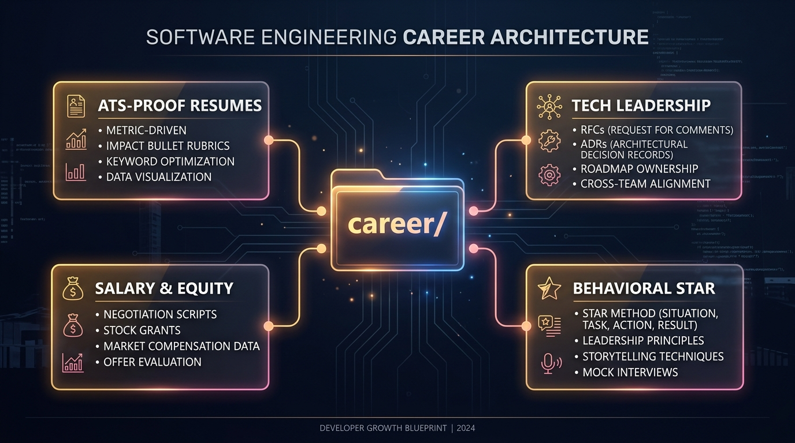

# 💼 Career Strategy & Engineering Leadership

> **Navigate your mobile engineering trajectory: High-impact resumes, salary negotiation, take-home challenge mastery, and Staff+ engineering leadership.**

---

## 🧭 Career Modules

| Module | Guide Hub | Key Topics |
| :--- | :--- | :--- |
| **Career Growth & Strategy** | **[Career Growth Hub](./career-growth/README.md)** | **[01. Resume Guide](./career-growth/01_Resume_Guide.md)** (Impact metrics, ATS optimization) **[02. Take-Home Challenges](./career-growth/02_Take_Home_Challenges.md)** (Scoring rubrics, clean architecture, documentation) **[03. Salary Negotiation](./career-growth/03_Salary_Negotiation.md)** (Total compensation, equity/RSUs, counter-offer scripts). |
| **Engineering Leadership** | **[Leadership Hub](./leadership/README.md)** | **[01. Engineering Management](./leadership/01_Engineering_Management.md)** (1:1s, performance reviews) **[02. Technical Leadership](./leadership/02_Technical_Leadership.md)** (RFCs, ADRs, technical roadmap) **[03. Project Management](./leadership/03_Project_Management.md)** (Scrum, Kanban, estimating) **[04. Behavioral Questions](./leadership/04_Behavioral_Questions.md)** (STAR method framework) **[05. Hiring & Culture](./leadership/05_Hiring_and_Culture.md)** (Interview calibration, onboarding). |

---

[⬅️ Back to Master Overview](../README.md)
