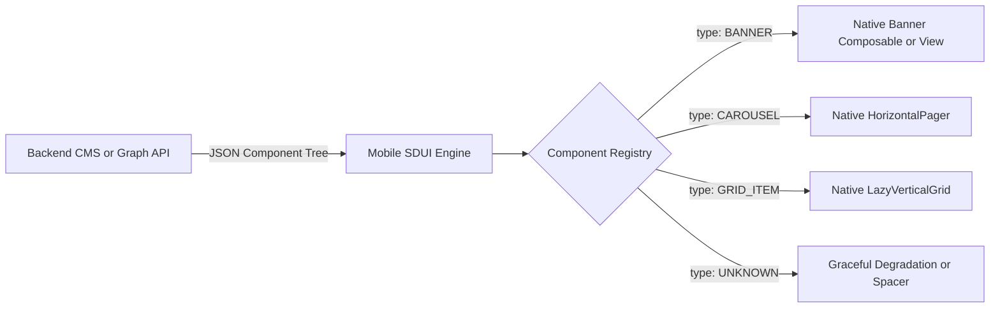

# 🎨 Server-Driven UI (SDUI) Frameworks & Dynamic Layouts

> **Designing high-performance, cross-platform Server-Driven UI architectures for Android (Compose) and iOS (SwiftUI) — component registries, schema contracts, action routing, and offline fallbacks.**

---

## 🎯 1. Why Server-Driven UI (SDUI)?

In traditional mobile architectures, changing a layout, introducing a promotional banner, or reordering an onboarding flow requires an **App Store / Play Store release** (3–7 day review lag, fragmented version adoption).

**SDUI decouples UI layout and business logic from the mobile client binary**:
* The server sends a **Component Tree Schema (JSON / Protobuf)** defining *what* components to render and *where*.
* The mobile client renders native Jetpack Compose / SwiftUI widgets mapped to those schema definitions.
* Enables instant zero-deployment A/B testing, remote layout experimentation, and dynamic personalized feeds.



---

## 📄 2. The Universal SDUI Schema Contract (JSON / Protobuf)

A robust SDUI contract requires four universal building blocks:
1. **Type Identifier**: Links schema node to native widget.
2. **Props / Data**: Text, images, colors, typography.
3. **Style / Constraints**: Margins, padding, aspect ratio, background.
4. **Actions**: Navigation, analytics, network triggers.

```json
{
  "screen_id": "home_feed_v2",
  "version": 3,
  "root": {
    "type": "COLUMN",
    "children": [
      {
        "type": "PROMO_HERO_BANNER",
        "props": {
          "title": "Flash Sale: Up to 50% Off",
          "subtitle": "Exclusive for Mobile App Users",
          "image_url": "https://cdn.example.com/promo.webp",
          "background_color": "#1A1B2F"
        },
        "style": {
          "padding_horizontal": 16,
          "padding_vertical": 8,
          "corner_radius": 16
        },
        "actions": {
          "on_click": {
            "type": "NAVIGATE_DEEP_LINK",
            "url": "app://sale/electronics?source=home_hero",
            "track_event": "promo_banner_clicked"
          }
        }
      },
      {
        "type": "PRODUCT_CAROUSEL",
        "props": {
          "section_title": "Recommended For You",
          "items": [
            { "id": "p101", "name": "Wireless Noise-Canceling Headphones", "price": "$199.99" },
            { "id": "p102", "name": "Ultra-Slim Smartwatch", "price": "$149.00" }
          ]
        }
      }
    ]
  }
}
```

---

## 💻 3. Jetpack Compose Component Registry Implementation

```kotlin
// 1. Domain Component Representation
sealed interface SduiNode {
    val id: String
    val actions: Map<String, SduiAction>?

    data class ColumnNode(
        override val id: String,
        val children: List<SduiNode>,
        override val actions: Map<String, SduiAction>? = null
    ) : SduiNode

    data class PromoHeroNode(
        override val id: String,
        val title: String,
        val subtitle: String,
        val imageUrl: String,
        val backgroundColorHex: String,
        override val actions: Map<String, SduiAction>? = null
    ) : SduiNode

    data class UnknownNode(override val id: String) : SduiNode
}

// 2. Component Renderer Registry
@Composable
fun SduiComponentRenderer(
    node: SduiNode,
    onAction: (SduiAction) -> Unit,
    modifier: Modifier = Modifier
) {
    when (node) {
        is SduiNode.ColumnNode -> {
            Column(modifier = modifier) {
                node.children.forEach { child ->
                    SduiComponentRenderer(node = child, onAction = onAction)
                }
            }
        }
        is SduiNode.PromoHeroNode -> {
            PromoHeroBanner(
                title = node.title,
                subtitle = node.subtitle,
                imageUrl = node.imageUrl,
                bgColor = Color(android.graphics.Color.parseColor(node.backgroundColorHex)),
                onClick = { node.actions?.get("on_click")?.let(onAction) }
            )
        }
        is SduiNode.UnknownNode -> {
            // Graceful Degradation: Log telemetry and render nothing or spacer
            Spacer(modifier = Modifier.height(0.dp))
        }
    }
}
```

---

## 🍎 4. SwiftUI Component Registry Implementation

```swift
// 1. Recursive View Builder for SwiftUI
struct SduiViewRenderer: View {
    let node: SduiNode
    let onAction: (SduiAction) -> Void

    var body: some View {
        switch node {
        case .column(let id, let children):
            VStack(spacing: 8) {
                ForEach(children, id: \.id) { child in
                    SduiViewRenderer(node: child, onAction: onAction)
                }
            }
        case .promoHero(let id, let title, let subtitle, let imageURL, let action):
            PromoHeroView(title: title, subtitle: subtitle, imageURL: imageURL)
                .onTapGesture {
                    if let action = action { onAction(action) }
                }
        case .unknown:
            EmptyView()
        }
    }
}
```

---

## ⚡ 5. Production Architectural Challenges & Solutions

| Challenge | Real-World Impact | Production Engineering Solution |
|:---|:---|:---|
| **Unknown Component Versions** | Newer server schema sent to an older client app version crashes the layout. | **Strict Unknown Fallback Pattern**: All schema parsers map unmapped enum keys to `UnknownNode` rather than throwing JSON parsing exceptions. |
| **Parsing Latency & UI Jank** | Parsing a 500KB nested JSON schema on the main thread causes dropped frames. | Parse and deserialize JSON in a background thread (`Dispatchers.Default` / Swift `Task.detached`), emit immutable UI state to Compose/SwiftUI. |
| **Offline Degradation** | No network connection results in blank app screens. | Cache last-known validated SDUI schema in local SQLite/Room database with TTL and ETag headers. |
| **Payload Bloat** | Repetitive styling tokens waste bandwidth on cellular networks. | Use **Design System Token IDs** (`"style": "hero_primary"`) rather than inline RGB hex/pixel values; use Protobuf or Brotli compression. |
