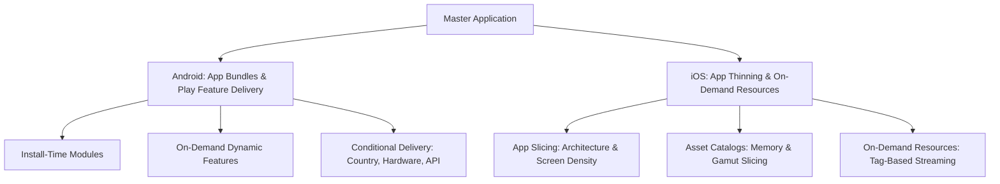
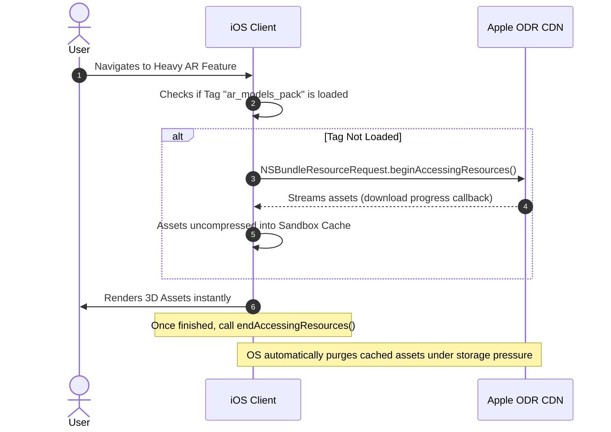

# 📦 Dynamic Feature Delivery & App Thinning

> **Architecting modular, ultra-lean mobile binaries for Android and iOS — Google Play Feature Delivery (`SplitInstallManager`), iOS App Thinning (App Slicing, Asset Catalogs), and On-Demand Resources (ODR).**

---

## 🎯 1. Why App Size & Modularity Matter

Mobile download size directly correlates with user acquisition and conversion rates:
* **Play Store data**: For every 6 MB increase in APK/AAB size, install conversion drops by **~1%**. In emerging markets (variable cellular bandwidth), drops exceed **2.5% per 6 MB**.
* **Cellular Download Thresholds**: Both iOS and Android enforce or warn against large cellular downloads (App Store historically enforces a 200MB limit for unmetered downloads).
* **Disk Footprint**: Bloated app installs are the primary target when users run OS "Storage Cleanup" assistants.



---

## 🤖 2. Google Play Feature Delivery (Android)

Android App Bundles (`.aab`) decouple build artifacts from device-specific delivery. Google Play generates and signs optimized APKs tailored to:
1. **ABI Architecture** (`arm64-v8a`, `armeabi-v7a`, `x86_64`).
2. **Screen Density** (`xxhdpi`, `xxxhdpi`, etc.).
3. **Language Resources** (downloaded dynamically when device locale changes).

### Delivery Modes

| Delivery Type | When It Installs | Ideal Use Case | Manifest Declaration |
|:---|:---|:---|:---|
| **Install-Time** | Automatically downloaded upon initial app install. | Core features that must be modularized for compile-time speed. | `<dist:install-time />` |
| **On-Demand** | Downloaded when requested programmatically at runtime. | Heavy features used by a subset of users (e.g., AR Scanner, Video Editor, Checkout). | `<dist:on-demand />` |
| **Conditional** | Downloaded at install-time only if device satisfies device conditions. | Camera features requiring `android.hardware.camera.ar`, country-specific modules. | `<dist:conditions> <dist:device-feature> ... </dist:conditions>` |

---

### Implementation: Dynamic On-Demand Feature Request

```kotlin
import android.content.Context
import com.google.android.play.core.splitinstall.*
import com.google.android.play.core.splitinstall.model.SplitInstallSessionStatus
import kotlinx.coroutines.channels.awaitClose
import kotlinx.coroutines.flow.Flow
import kotlinx.coroutines.flow.callbackFlow

sealed interface FeatureDownloadState {
    data object Idle : FeatureDownloadState
    data class Downloading(val bytesDownloaded: Long, val totalBytes: Long, val progressFraction: Float) : FeatureDownloadState
    data object Installing : FeatureDownloadState
    data object Installed : FeatureDownloadState
    data class Failed(val errorCode: Int, val errorMessage: String) : FeatureDownloadState
}

class DynamicFeatureManager(private val context: Context) {
    private val splitInstallManager: SplitInstallManager = SplitInstallManagerFactory.create(context)

    fun isFeatureInstalled(moduleName: String): Boolean {
        return splitInstallManager.installedModules.contains(moduleName)
    }

    fun downloadAndInstallModule(moduleName: String): Flow<FeatureDownloadState> = callbackFlow {
        if (isFeatureInstalled(moduleName)) {
            trySend(FeatureDownloadState.Installed)
            close()
            return@callbackFlow
        }

        val request = SplitInstallRequest.newBuilder()
            .addModule(moduleName)
            .build()

        val listener = SplitInstallStateUpdatedListener { state ->
            if (state.sessionId() == sessionIdRef) {
                when (state.status()) {
                    SplitInstallSessionStatus.DOWNLOADING -> {
                        val progress = if (state.totalBytesToDownload() > 0) {
                            state.bytesDownloaded().toFloat() / state.totalBytesToDownload().toFloat()
                        } else 0f
                        trySend(FeatureDownloadState.Downloading(
                            bytesDownloaded = state.bytesDownloaded(),
                            totalBytes = state.totalBytesToDownload(),
                            progressFraction = progress
                        ))
                    }
                    SplitInstallSessionStatus.INSTALLING -> {
                        trySend(FeatureDownloadState.Installing)
                    }
                    SplitInstallSessionStatus.INSTALLED -> {
                        trySend(FeatureDownloadState.Installed)
                        close()
                    }
                    SplitInstallSessionStatus.FAILED -> {
                        trySend(FeatureDownloadState.Failed(state.errorCode(), "Installation failed with error code: ${state.errorCode()}"))
                        close()
                    }
                    SplitInstallSessionStatus.CANCELED -> {
                        trySend(FeatureDownloadState.Failed(state.errorCode(), "Installation was canceled"))
                        close()
                    }
                    else -> Unit
                }
            }
        }

        var sessionIdRef = 0
        splitInstallManager.registerListener(listener)

        splitInstallManager.startInstall(request)
            .addOnSuccessListener { sessionId ->
                sessionIdRef = sessionId
            }
            .addOnFailureListener { exception ->
                trySend(FeatureDownloadState.Failed(-1, exception.localizedMessage ?: "Unknown error"))
                close()
            }

        awaitClose {
            splitInstallManager.unregisterListener(listener)
        }
    }
}
```

> [!IMPORTANT]
> **Splits and Immediate Access**: After a split is downloaded, call `SplitCompat.installActivity(context)` inside your Base Application and Activity `attachBaseContext()` to make code and resources accessible without requiring an immediate app process restart.

---

## 🍎 3. iOS App Thinning & On-Demand Resources (ODR)

iOS App Thinning encompasses three distinct mechanisms managed by Apple:
1. **App Slicing**: The App Store produces tailored IPAs containing only the 64-bit architecture slice (e.g., `arm64`) and asset density (`@2x` vs `@3x`) for the user's specific iPhone model.
2. **Asset Catalogs**: Vector assets, high-gamut Display P3 colors, and Metal shaders are sliced according to device GPU capabilities.
3. **On-Demand Resources (ODR)**: Asset content hosted on Apple servers and downloaded dynamically using tags (`NSBundleResourceRequest`).



---

### Implementation: On-Demand Resources (ODR) Manager in Swift

```swift
import Foundation
import Combine

enum ODRState {
    case notLoaded
    case loading(progress: Double)
    case loaded
    case failed(Error)
}

@MainActor
final class OnDemandResourceManager: ObservableObject {
    @Published private(set) var state: ODRState = .notLoaded
    private var resourceRequest: NSBundleResourceRequest?
    private var progressCancellable: AnyCancellable?

    func loadResources(forTag tag: String, priority: Double = 0.8) async {
        // Release previous request if holding
        resourceRequest?.endAccessingResources()

        let tags: Set<String> = [tag]
        let request = NSBundleResourceRequest(tags: tags)
        request.loadingPriority = priority
        self.resourceRequest = request

        // Track progress
        progressCancellable = request.progress.publisher(for: \.fractionCompleted)
            .receive(on: DispatchQueue.main)
            .sink { [weak self] fraction in
                self?.state = .loading(progress: fraction)
            }

        do {
            try await request.beginAccessingResources()
            self.state = .loaded
        } catch {
            self.state = .failed(error)
        }
    }

    func releaseResources() {
        progressCancellable?.cancel()
        resourceRequest?.endAccessingResources()
        resourceRequest = nil
        state = .notLoaded
    }

    deinit {
        resourceRequest?.endAccessingResources()
    }
}
```

---

## ⚖️ 4. Android vs iOS Modular Delivery Comparison

| Architectural Feature | Android (Play Feature Delivery) | iOS (App Thinning & ODR) |
|:---|:---|:---|
| **Executable Code Delivery** | ✅ Fully dynamic (Downloads `.dex` & native `.so` files at runtime). | ❌ **Forbidden by App Store Review Guidelines** (Only data/assets allowed; binary executable code must be packaged in initial bundle). |
| **Asset Streaming** | Play Asset Delivery (Fast-follow, On-demand, Install-time). | On-Demand Resources (ODR) with tags via `NSBundleResourceRequest`. |
| **Max Download Limits** | Up to 150 MB per dynamic feature module; 2 GB total asset pack size. | Up to 20 GB of assets per app, with individual tag limits (e.g., 4 GB max downloaded at one time). |
| **Eviction Policy** | Manual via `SplitInstallManager.deferredUninstall()` or storage manager. | Automatic LRU eviction by iOS when device storage is constrained. |
| **Local Testing** | `bundletool` or Google Play Internal App Sharing. | Xcode Asset Catalog scheme tag assignments & disk simulation. |

---

## 💡 5. Staff-Level Interview Questions & Gotchas

### Q1: Can you download executable Swift/Objective-C code dynamically on iOS like Android's Dynamic Feature Modules?
> **Answer**: No. Section 2.5.2 of the Apple App Store Review Guidelines strictly prohibits downloading, installing, or executing code that introduces new features or functionality. The only dynamic code allowed is interpreted script code executed in WebViews or JavaScriptCore, provided it does not alter the primary purpose of the application. On Android, Dynamic Feature Modules can compile `.dex` and `.so` files and dynamically load them into the classloader using `SplitCompat`.

### Q2: How do you handle deep links into a Dynamic Feature module that is not yet installed on the device?
> **Answer**: Implement an **Intermediary Routing Trampoline**:
> 1. The deep-link router intercepts the target URI and checks `SplitInstallManager.installedModules`.
> 2. If not installed, it navigates to a lightweight generic `FeatureInstallActivity` passing the target route and module ID.
> 3. The install screen displays a branded downloading progress animation while observing `SplitInstallStateUpdatedListener`.
> 4. Upon `INSTALLED`, `SplitCompat.installActivity()` is invoked, and the pending deep-link intent is re-dispatched to the now-available activity.

### Q3: What happens to ODR assets when the user runs out of storage space on their iPhone?
> **Answer**: Any resource tag where `endAccessingResources()` has been called moves from **In-Use** to **Cached** state. When iOS encounters low storage conditions, the operating system purges cached ODR assets on a Least Recently Used (LRU) basis without prompting the user. The app must be architected to never assume a previously downloaded tag is permanently available; it must always verify access via `beginAccessingResources()` before reading the resource.
