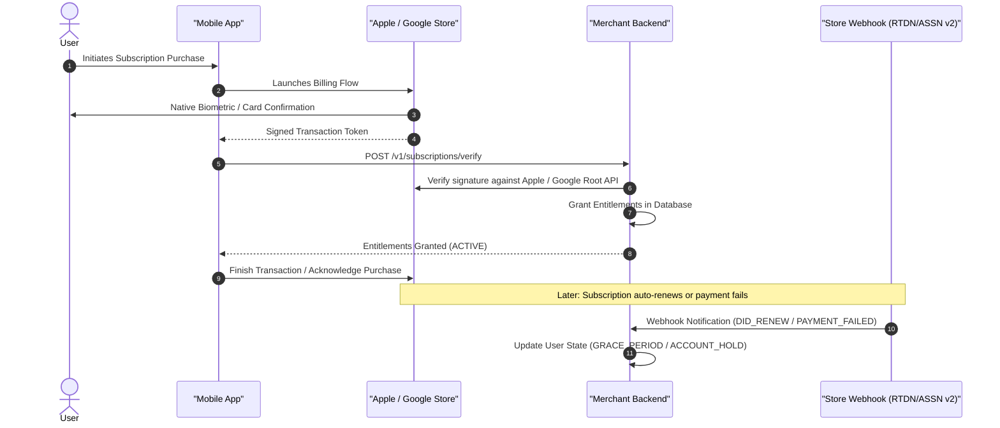
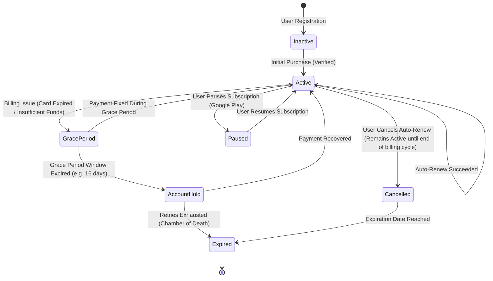

# 💳 In-App Purchases (IAP) & Subscription State Machines

> **Production-grade mobile monetization architectures — StoreKit 2 (iOS) vs Google Play Billing 7.0+ (Android), cryptographically verified receipts, real-time webhooks, and the resilient Subscription State Machine.**

---

## 🎯 1. Modern Mobile Monetization Overview

Mobile subscription engineering requires absolute synchronization between three distributed systems:
1. **Device Store Clients** (Apple StoreKit 2 / Google Play Billing).
2. **App Store Payment Infrastructure** (Apple In-App Purchase servers / Google Play Developer APIs).
3. **Your Backend Entitlement Authority** (PostgreSQL / Redis subscription database).

Never trust the client alone to grant premium entitlements. The client initiates the checkout and receives signed proof; the backend verifies signatures and orchestrates the true state of the user account.



---

## 🔄 2. The Universal Subscription State Machine

A production subscription system is an event-driven finite state machine (FSM). Failing to handle intermediate states like **Grace Period** and **Account Hold** leads to massive involuntary churn.



### Detailed State Definitions & Entitlement Policies

| State | Definition | Entitlement Access Policy | Typical Business Action |
|:---|:---|:---|:---|
| **ACTIVE** | Subscription is paid and valid. | Full Access to Premium Features. | Regular usage metrics. |
| **GRACE_PERIOD** | Card failed to renew, but the store allows temporary grace (typically 16 days). | **Grant Full Access**. User should not be disrupted. | Display persistent soft banner: *"Update your payment method to keep Pro."* |
| **ACCOUNT_HOLD** | Grace period expired without payment recovery. Subscription paused by store. | **Revoke Access**. Lock Pro features. | Show blocking modal: *"Your subscription is on hold. Update billing in App Store settings."* |
| **PAUSED** | User explicitly paused billing (Google Play feature, up to 3 months). | **Revoke Access**. | Keep user data intact, offer early resume discounts. |
| **CANCELLED** | User turned off auto-renew in store settings, but current billing period is unexpired. | **Grant Full Access** until `expires_date`. | Show win-back offers and exit surveys. |
| **EXPIRED** | Period lapsed and payment was never recovered. | **Revoke Access**. Revert to Free tier. | Target with win-back push campaigns and email offers. |

---

## 🍎 3. Modern StoreKit 2 Implementation (Swift)

StoreKit 2 utilizes modern Swift Concurrency (`async/await`, `AsyncSequence`) and cryptographically signed **JSON Web Signatures (JWS)**.

```swift
import StoreKit
import Foundation

@MainActor
final class StoreKit2Manager: ObservableObject {
    @Published private(set) var proSubscriptionProduct: Product?
    @Published private(set) var isProUser: Bool = false
    
    private var updatesTask: Task<Void, Never>?

    init() {
        updatesTask = listenForTransactionUpdates()
        Task {
            await fetchProducts()
            await updatePurchasedStatus()
        }
    }

    deinit {
        updatesTask?.cancel()
    }

    // 1. Fetch products from App Store
    func fetchProducts() async {
        do {
            let products = try await Product.products(for: ["com.example.app.subscription.pro.monthly"])
            self.proSubscriptionProduct = products.first
        } catch {
            print("Failed to fetch products: \(error)")
        }
    }

    // 2. Continuous Transaction Listener (Background renewals, refunds, family sharing)
    private func listenForTransactionUpdates() -> Task<Void, Never> {
        Task.detached {
            for await result in Transaction.updates {
                do {
                    let transaction = try self.verifyTransaction(result)
                    await self.processAndFinish(transaction)
                } catch {
                    print("Unverified transaction received: \(error)")
                }
            }
        }
    }

    // 3. Launch Checkout Flow
    func purchasePro() async throws -> Bool {
        guard let product = proSubscriptionProduct else { return false }
        
        let result = try await product.purchase()
        
        switch result {
        case .success(let verification):
            let transaction = try verifyTransaction(verification)
            await processAndFinish(transaction)
            return true
            
        case .userCancelled:
            return false
            
        case .pending:
            // Family Sharing approval or Ask-to-Buy
            return false
            
        @unknown default:
            return false
        }
    }

    // 4. Cryptographic JWS Verification
    private func verifyTransaction<T>(_ result: VerificationResult<T>) throws -> T {
        switch result {
        case .unverified(_, let error):
            throw error
        case .verified(let safeValue):
            return safeValue
        }
    }

    private func processAndFinish(_ transaction: Transaction) async {
        // Always send transaction.jwsRepresentation to backend for server-side recording
        await notifyBackendOfPurchase(jwsToken: transaction.jwsRepresentation)
        
        // Critical: Always call finish() to notify App Store that entitlement was delivered
        await transaction.finish()
        await updatePurchasedStatus()
    }

    func updatePurchasedStatus() async {
        var hasActiveEntitlement = false
        for await result in Transaction.currentEntitlements {
            if case .verified(let transaction) = result {
                if transaction.productID == "com.example.app.subscription.pro.monthly" &&
                   transaction.revocationDate == nil {
                    hasActiveEntitlement = true
                    break
                }
            }
        }
        self.isProUser = hasActiveEntitlement
    }

    private func notifyBackendOfPurchase(jwsToken: String) async {
        // Dispatch to merchant backend for server verification
    }
}
```

---

## 🤖 4. Modern Google Play Billing 7.0+ Implementation (Kotlin)

Google Play Billing 7.0+ enforces the unified `ProductDetails` API and strict **Purchase Acknowledgment** within 3 days (otherwise Google automatically refunds and revokes the purchase).

```kotlin
import android.app.Activity
import android.content.Context
import com.android.billingclient.api.*
import kotlinx.coroutines.*
import kotlinx.coroutines.flow.MutableStateFlow
import kotlinx.coroutines.flow.StateFlow

class GooglePlayBillingManager(
    private val context: Context,
    private val externalScope: CoroutineScope
) : PurchasesUpdatedListener, BillingClientStateListener {

    private val _isProUser = MutableStateFlow(false)
    val isProUser: StateFlow<Boolean> = _isProUser

    private val billingClient: BillingClient = BillingClient.newBuilder(context)
        .setListener(this)
        .enablePendingPurchases()
        .build()

    private var cachedProductDetails: ProductDetails? = null

    fun startConnection() {
        billingClient.startConnection(this)
    }

    override fun onBillingSetupFinished(billingResult: BillingResult) {
        if (billingResult.responseCode == BillingClient.BillingResponseCode.OK) {
            querySubscriptionProducts()
            queryExistingPurchases()
        }
    }

    override fun onBillingServiceDisconnected() {
        // Exponential backoff reconnect logic
    }

    private fun querySubscriptionProducts() {
        val productList = listOf(
            QueryProductDetailsParams.Product.newBuilder()
                .setProductId("pro_subscription_monthly")
                .setProductType(BillingClient.ProductType.SUBS)
                .build()
        )
        val params = QueryProductDetailsParams.newBuilder().setProductList(productList).build()

        billingClient.queryProductDetailsAsync(params) { result, productDetailsList ->
            if (result.responseCode == BillingClient.BillingResponseCode.OK) {
                cachedProductDetails = productDetailsList.firstOrNull()
            }
        }
    }

    fun launchBillingFlow(activity: Activity) {
        val productDetails = cachedProductDetails ?: return
        val offerToken = productDetails.subscriptionOfferDetails?.firstOrNull()?.offerToken ?: return

        val productDetailsParamsList = listOf(
            BillingFlowParams.ProductDetailsParams.newBuilder()
                .setProductDetails(productDetails)
                .setOfferToken(offerToken)
                .build()
        )

        val billingFlowParams = BillingFlowParams.newBuilder()
            .setProductDetailsParamsList(productDetailsParamsList)
            .build()

        billingClient.launchBillingFlow(activity, billingFlowParams)
    }

    override fun onPurchasesUpdated(billingResult: BillingResult, purchases: List<Purchase>?) {
        if (billingResult.responseCode == BillingClient.BillingResponseCode.OK && purchases != null) {
            for (purchase in purchases) {
                externalScope.launch {
                    handlePurchase(purchase)
                }
            }
        }
    }

    private suspend fun handlePurchase(purchase: Purchase) = withContext(Dispatchers.IO) {
        if (purchase.purchaseState == Purchase.PurchaseState.PURCHASED) {
            // 1. Verify purchase token on backend server
            val isVerifiedByServer = verifyPurchaseOnBackend(purchase.purchaseToken, purchase.orderId)
            
            // 2. Acknowledge purchase within 3 days, otherwise Google issues an automatic refund
            if (isVerifiedByServer && !purchase.isAcknowledged) {
                val acknowledgeParams = AcknowledgePurchaseParams.newBuilder()
                    .setPurchaseToken(purchase.purchaseToken)
                    .build()
                billingClient.acknowledgePurchase(acknowledgeParams) { ackResult ->
                    if (ackResult.responseCode == BillingClient.BillingResponseCode.OK) {
                        _isProUser.value = true
                    }
                }
            }
        }
    }

    private fun queryExistingPurchases() {
        val params = QueryPurchasesParams.newBuilder()
            .setProductType(BillingClient.ProductType.SUBS)
            .build()
        billingClient.queryPurchasesAsync(params) { result, purchases ->
            if (result.responseCode == BillingClient.BillingResponseCode.OK) {
                val hasActive = purchases.any { it.purchaseState == Purchase.PurchaseState.PURCHASED }
                _isProUser.value = hasActive
            }
        }
    }

    private suspend fun verifyPurchaseOnBackend(token: String, orderId: String?): Boolean {
        // Network call to backend POST /v1/billing/verify
        return true
    }
}
```

---

## 🛡️ 5. Server-Side Cryptographic Verification & Webhooks

### Real-Time Developer Notifications (RTDN) & App Store Server Notifications (ASSN v2)

| Channel | Protocol | Security Mechanism | Key Events Handled |
|:---|:---|:---|:---|
| **Apple ASSN v2** | HTTP POST webhook from Apple | Signed JWS decoded using Apple Root CA public keys | `DID_RENEW`, `DID_FAIL_TO_RENEW`, `GRACE_PERIOD_EXPIRED`, `REFUND`, `REVOKE` |
| **Google Play RTDN** | Google Cloud Pub/Sub message | Service Account IAM + verification via Google Play Developer API | `SUBSCRIPTION_RENEWED`, `SUBSCRIPTION_IN_GRACE_PERIOD`, `SUBSCRIPTION_ON_HOLD`, `SUBSCRIPTION_CANCELED` |

### Critical Anti-Fraud Engineering Best Practices

1. **Strict Idempotency**:
   * Every incoming webhook carries a unique notification or transaction ID (`originalTransactionId` for Apple, `purchaseToken` / `orderId` for Google).
   * Persist every notification in an `idempotency_keys` table. Reject duplicates with an immediate `HTTP 200 OK` to prevent duplicate crediting or race conditions.
2. **Never Trust the Client to Grant Privileges**:
   * A compromised or jailbroken device can spoof `Transaction.currentEntitlements` using tools like Frida or Objection.
   * Mobile clients should only display UI based on entitlements fetched from **your authenticated API server**.
3. **Handle Pending / "Ask to Buy" Transactions**:
   * Minors using parental controls trigger `TransactionState.deferred` or `.pending`.
   * Never unlock features immediately; wait for `Transaction.updates` or backend webhooks once the parent approves the purchase.
