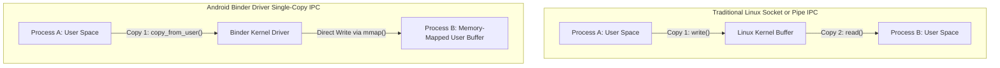
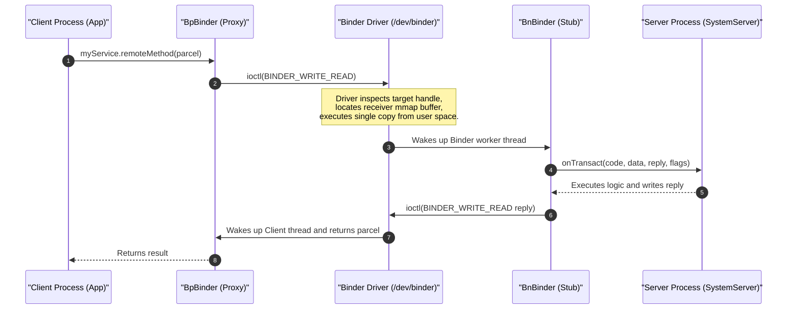
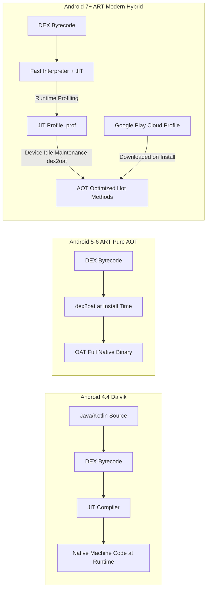
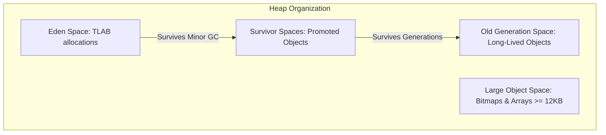

# 🔬 Android Binder IPC & ART Runtime Internals

> **A Staff-Level deep dive into the Linux kernel driver powering Android inter-process communication (Binder) and the execution mechanics of the Android Runtime (ART) — single-copy `mmap`, `TransactionTooLargeException`, PGO compilation, and Generational Concurrent Copying GC.**

---

## 🎯 1. Android IPC: Why Not Standard Linux IPC?

Standard Linux distributions offer several Inter-Process Communication (IPC) primitives: **Pipes, FIFOs, UNIX Domain Sockets, and System V / POSIX Shared Memory**. 

Android rejected these as the primary application IPC backbone for two architectural reasons: **Memory Overhead (Copies)** and **Security (UID/PID Provenance)**.

### The Architectural Advantages of Binder

1. **Single-Copy Efficiency (`mmap`)**:
   * Sockets/Pipes require **two memory copies** (User Process A $\to$ Kernel Space $\to$ User Process B).
   * Shared Memory requires zero copies, but provides no synchronization, reference counting, or security.
   * **Binder requires exactly ONE copy**: Process B memory-maps a read-only buffer from `/dev/binder` into its address space during initialization (`ProcessState::self()`). When Process A sends a Parcel, the Binder kernel driver copies the data **directly from Process A's user space into Process B's mapped memory buffer** via `copy_from_user()`.
2. **Unforgeable Security Credentials**:
   * Sockets can be spoofed or require socket option overhead (`SO_PEERCRED`).
   * The Binder kernel driver automatically injects the caller's true Linux UID and PID into every transaction (`Binder.getCallingUid()`, `Binder.getCallingPid()`). Process A cannot fake its identity.
3. **Object Lifecycle & Death Notifications**:
   * Binder supports distributed reference counting across processes (`sp<IBinder>`, `wp<IBinder>`).
   * Clients can link a `DeathRecipient` to a remote Binder object; if the hosting process crashes or is killed by the Low Memory Killer (LMK), the kernel notifies the client immediately.

---

## 🏛️ 2. Binder Architecture & Communication Flow

### The 1MB Transaction Buffer Limit & `TransactionTooLargeException`

Every process has a shared Binder memory pool mapped by the kernel:
* **Size**: 1 MB (specifically `1048576 - (PAGE_SIZE * 2)` bytes $\approx 1016 \text{ KB}$).
* **Critical Rule**: This 1 MB limit is **shared across all concurrent Binder transactions** in the entire process (including `Intent` extras, `Bundle` state in `onSaveInstanceState`, and all active AIDL calls).

> [!CAUTION]
> If a transaction payload (or concurrent cumulative payloads) exceeds this buffer, the kernel driver returns `FAILED_TRANSACTION`, and the runtime throws `android.os.TransactionTooLargeException`.

#### Production Mitigation Strategies:
1. **Never pass Bitmaps, large Byte Arrays, or lengthy JSON lists through Intents/AIDL**.
2. **Use `ParcelFileDescriptor` / `SharedMemory` (Ashmem)**: Pass file descriptors pointing to anonymous shared memory or local disk files; file descriptors are lightweight integer references passed across the kernel driver without buffer bloat.
3. **Cache on Disk / SQLite**: Pass a unique record ID across the Binder transaction and let the receiving process query the database.

---

### Binder Thread Pool & Thread Starvation

When a process hosts a Binder service:
* Android initializes a default thread pool capped at **16 worker threads** (`BINDER_SET_MAX_THREADS` set to 15, plus 1 main thread).
* Threads are named `binder:pid_X` (e.g., `binder:1842_2`).
* If 16 simultaneous synchronous Binder calls block (e.g., waiting for slow disk I/O or downstream remote services), subsequent incoming Binder requests are queued or rejected, leading to **system-wide ANRs**.

---

## ⚡ 3. Android Runtime (ART) vs Dalvik

### Evolution of the Android Virtual Machine

| Era | Architecture | Strengths | Severe Bottlenecks |
|:---|:---|:---|:---|
| **Dalvik** *(Android 1.0–4.4)* | Stack/Register Hybrid Interpreter + Trace JIT | Minimal install time, low storage footprint. | High CPU/battery drain, sluggish cold starts, jittery frame rates during JIT spikes. |
| **Early ART** *(Android 5.0–6.0)* | Pure Ahead-Of-Time (AOT) via `dex2oat` | Fast app startup, zero runtime JIT overhead. | Huge app installation delays (minutes for large apps), double storage footprint (`.oat` binaries). |
| **Modern ART** *(Android 7.0–14+)* | **Hybrid JIT + AOT with Profile-Guided Optimization (PGO)** | Fast install, instant cold startup for hot paths, minimal storage bloat. | Requires background maintenance cycles to fully optimize. |
| **ART Mainline APEX** *(Android 12+)* | Updatable Modular Runtime via Google Play | Core runtime and GC can be updated without full OS OTA. | Requires compatibility testing across OEM vendors. |

---

### How Profile-Guided Optimization (PGO) Works

1. **Initial Install**: App is installed instantly without compiling all bytecode to native machine code.
2. **First Run (Interpreter + JIT)**: ART executes code using a fast interpreter. Hot methods (loops, frequently called functions) are compiled on-the-fly by the JIT compiler.
3. **Profiling (`.prof`)**: ART tracks which methods are executed during app startup and key user flows, storing signatures in a compact profile file (`/data/misc/profiles/cur/0/pkg_name/primary.prof`).
4. **Background AOT Compilation**: When the device is **idle and connected to power**, the `dexopt` background daemon runs `dex2oat` against the hot methods identified in the profile, compiling them into optimized machine code (`.odex` / `.vdex`).
5. **Google Play Cloud Profiles**: Google Play aggregates anonymized profiles from thousands of early users and ships a **baseline profile (`baseline.prof`)** directly inside the APK/AAB. New users get optimized cold-start performance on their very first launch!

---

## 🧹 4. ART Garbage Collection (GC) Deep Dive

Early Dalvik garbage collection caused noticeable frame drops (the dreaded *"Stop-The-World"* pause lasting 50–100ms). Modern ART uses the **Generational Concurrent Copying (CC) GC**.

### Key Innovations of ART Generational CC GC

1. **Concurrent Execution**:
   * Garbage collection runs concurrently with application mutator threads.
   * Pause times are typically **less than 1 millisecond**, well within a 16.6ms (60fps) or 8.3ms (120fps) frame budget.
2. **Moving / Compacting Collector**:
   * As objects are moved to eliminate memory fragmentation, ART updates references without locking all threads using a **Read Barrier**.
   * A read barrier checks if the requested object has been relocated; if so, it reads the updated forwarding address (Baker-style read barrier using bits in the object's lock word).
3. **Thread-Local Allocation Buffers (TLAB)**:
   * Threads allocate memory in dedicated local heap blocks without acquiring global heap mutex locks, drastically accelerating object instantiation in Kotlin/Java.

---

## 💡 5. Staff-Level Interview Questions

### Q1: What happens under the hood when `onSaveInstanceState(Bundle outState)` is called before process death?
> **Answer**: `onSaveInstanceState` serializes UI state into an `android.os.Bundle`. This Bundle is transmitted to `ActivityManagerService` (inside `system_server`) via a synchronous **Binder transaction**. Because the transaction utilizes the process's shared 1 MB Binder buffer, saving large lists or bitmaps directly into the bundle will immediately throw `TransactionTooLargeException` and crash the application. UI state must be restricted to minimal identifiers (IDs, scroll offsets), while large dataset state must be cached in local storage.

### Q2: What is the difference between `.vdex`, `.odex`, and `.art` files generated by ART?
> **Answer**:
> * **`.vdex` (Verified DEX)**: Contains the uncompressed, pre-verified DEX files of the APK. It saves verification time across subsequent compilations.
> * **`.odex` (Optimized DEX)**: Contains AOT-compiled native machine code for the hot methods specified by the compilation profile.
> * **`.art` (ART Image File)**: Contains pre-initialized heap structures, class metadata, and string pools. When the app starts, this file is directly `mmap`'ed into the app's address space, bypassing class-loading overhead and speeding up startup.

### Q3: How does Binder prevent thread priority inversion when an app calls a high-priority system service?
> **Answer**: The Binder driver implements **Priority Inheritance**. When a high-priority thread (e.g., UI thread with high Linux thread niceness) makes a synchronous Binder call to a remote service, the Binder driver temporarily elevates the priority of the receiving worker thread in the target process to match the caller's priority. Once the transaction completes, the worker thread's original priority is restored.
