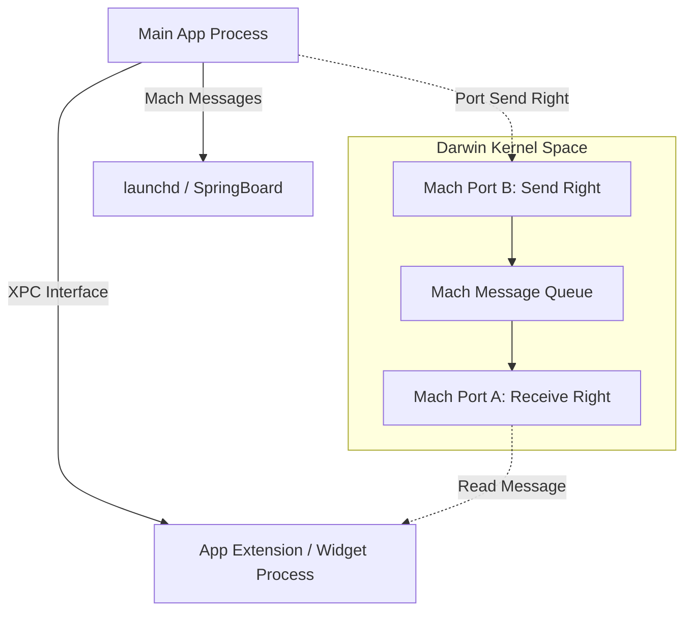
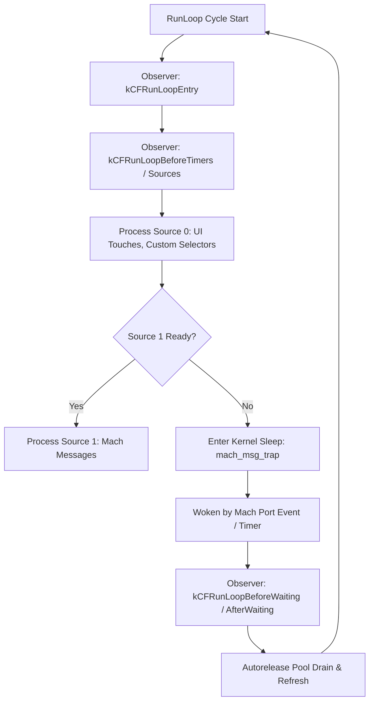
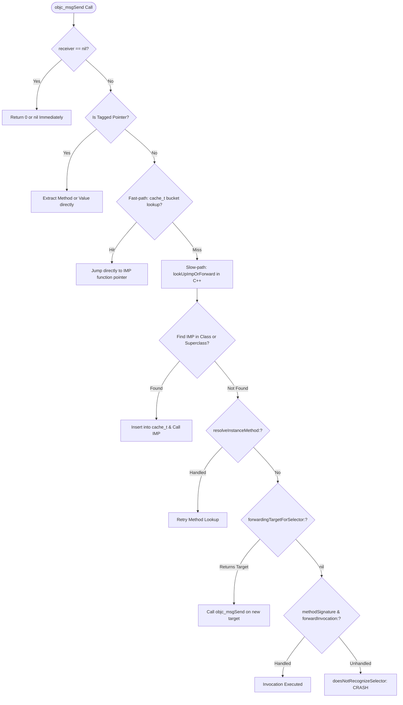
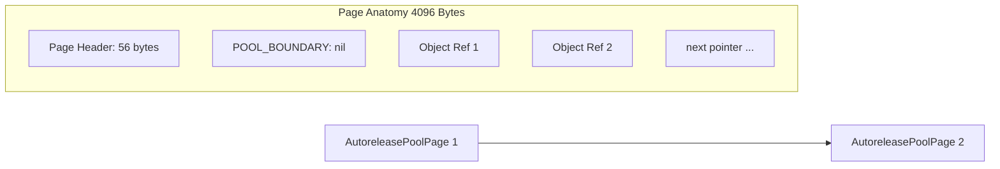

# 🍎 iOS Objective-C Runtime, Mach & XPC Internals

> **A Principal-Level deep dive into the Darwin kernel foundation and dynamic runtime underpinning iOS — Mach messages, XPC services, `objc_msgSend` assembly dispatch, tagged pointers, non-pointer `isa`, AutoreleasePool page memory layouts, and RunLoop architecture.**

---

## 🏛️ 1. Mach Kernel Architecture & XPC

Underneath iOS (Darwin / XNU kernel) lies the **Mach microkernel**, which manages core abstractions: tasks, threads, virtual memory, and inter-process communication (IPC) via **Mach Messages** and **Mach Ports**.



### Mach Ports & Capabilities

A **Mach Port** is a unidirectional, kernel-protected communication channel:
* **Port Rights**: A process must hold explicit rights to interact with a port:
  * **Receive Right**: Exactly *one* task can hold the receive right to pull messages off a port.
  * **Send Right**: Multiple tasks can hold send rights to dispatch messages.
  * **Send-Once Right**: A temporary right typically used for client-server reply tokens.
* **XPC (Cross-Process Communication)**:
  * Pure Mach messaging is low-level C. Apple wraps Mach IPC into **XPC**, an asynchronous, sandboxed, dictionary-based (`xpc_object_t`) protocol managed by `launchd`.
  * Every App Extension (Widgets, Notification Service Extensions, Share Extensions) runs in a distinct sandbox process communicating with your host app or iOS system services via XPC.

---

## 🔄 2. RunLoop Internals & Autorelease Pools

A `CFRunLoop` is an event-processing loop that keeps a thread active when work is available and puts it to sleep (`mach_msg_trap`) when idle, consuming zero CPU cycles.



### RunLoop Modes & Common Scroll Jank Trap

* `kCFRunLoopDefaultMode`: The default mode for processing general events, network responses, and background timers.
* `UITrackingRunLoopMode`: Mode entered **exclusively while the user is actively scrolling** a `UIScrollView` / `UITableView` / `UICollectionView`.
* `kCFRunLoopCommonModes`: A pseudo-mode grouping default and tracking modes together.

> [!WARNING]
> **The Scroll Jank Bug**: Scheduling a `Timer` with `Timer.scheduledTimer(...)` puts it in `.default` mode. When a user scrolls a feed, the RunLoop switches to `UITrackingRunLoopMode`, **starving your timer**. To ensure continuous firing, always add timers to `.common` modes:
> ```swift
> RunLoop.main.add(myTimer, forMode: .common)
> ```

---

## ⚡ 3. The `objc_msgSend` Execution Pipeline

In Objective-C and dynamic Swift (`@objc dynamic`), method calls are not direct function pointers; they are dynamic message dispatches executed via `objc_msgSend`.

```c
// [receiver message:arg] is compiled down to:
objc_msgSend(receiver, @selector(message:), arg);
```



### The 6 Stages of `objc_msgSend`

1. **Assembly Fast Path (`objc_msgSend.s`)**:
   * Written in pure hand-tuned ARM64 assembly to avoid creating stack frames.
   * Checks for `nil` (returns `0`/`nil` instantly without error).
   * Reads receiver's `isa` pointer, indexes the `cache_t` hash table bucket.
   * If cache hit, executes an indirect branch (`br x17`) directly to the `IMP` (implementation pointer). **Takes ~2 nanoseconds**.
2. **Slow Path Lookup (`lookUpImpOrForward`)**:
   * Acquires runtime lock. Searches the class's method list (`class_ro_t` / `class_rw_t`).
   * Iterates up the superclass hierarchy chain.
   * When found, populates `cache_t` so subsequent calls take the fast path.
3. **Dynamic Method Resolution**:
   * Invokes `+resolveInstanceMethod:` or `+resolveClassMethod:`.
   * Developer can dynamically call `class_addMethod(...)` at runtime to satisfy the selector.
4. **Fast Forwarding**:
   * Calls `-forwardingTargetForSelector:`.
   * Allows the object to redirect the message to a secondary delegate without packing an `NSInvocation`.
5. **Normal (Full) Forwarding**:
   * Calls `-methodSignatureForSelector:`. If valid signature is returned, the runtime creates an `NSInvocation` and calls `-forwardInvocation:`.
   * Used for distributed proxies, mocking frameworks, and multi-cast delegates.
6. **Crash (`doesNotRecognizeSelector:`)**:
   * If all 5 stages fail, the runtime throws `unrecognized selector sent to instance 0x...`.

---

## 🧬 4. 64-bit Memory Optimizations: Tagged Pointers & Non-Pointer `isa`

### Tagged Pointers

On 64-bit architectures (ARM64 / x86_64), a pointer is 8 bytes (64 bits). But typical primitive objects like `NSNumber(42)`, small `NSString` ("cat"), and `NSDate` require only a few bits of payload. Allocating them on the heap incurs malloc headers, reference counting, and cache misses.

**Solution: Store the data directly inside the pointer itself!**

```text
ARM64 Tagged Pointer Layout:
+----+---------------+------------------------------------------------------+
| 1  | 3-bit Tag ID  | 60-bit Embedded Data Payload                         |
+----+---------------+------------------------------------------------------+
  ^
  |-- MSB bit = 1 indicates this is a Tagged Pointer, NOT a memory address!
```

* **Tag IDs**: `0: NSNumber`, `1: NSString`, `2: NSDate`, `3: NSIndexPath`, etc.
* **Benefits**:
  * **Zero Heap Allocation**: Malloc/free overhead is completely bypassed.
  * **Zero Reference Counting**: `retain` and `release` are immediate no-ops.
  * **3x memory reduction** and instant creation speed.

---

### Non-Pointer `isa` (ARM64 Bitfield)

In modern 64-bit iOS, the `isa` member of an Objective-C object is no longer a plain 64-bit memory address pointing to a `Class`. Instead, it is an optimized bitfield:

```c
struct isa_t {
    uintptr_t nonpointer        : 1;  // 0 = raw pointer, 1 = bitfield struct
    uintptr_t has_assoc         : 1;  // Has associated objects?
    uintptr_t has_cxx_dtor      : 1;  // Has C++ or ARC destructors?
    uintptr_t shiftcls          : 33; // ACTUAL class pointer bits (mask: 0x7ffffffff8ULL)
    uintptr_t magic             : 6;  // Used by debugger to verify object validity
    uintptr_t weakly_referenced : 1;  // Is target of a __weak pointer?
    uintptr_t unused            : 1;  // Reserved
    uintptr_t has_sidetable_rc  : 1;  // Extra ref count overflowed into SideTable
    uintptr_t extra_rc          : 19; // Inline reference count (stores RC - 1 up to 524,287)
};
```

> [!NOTE]
> **ARC Performance**: Because the reference count is stored directly inside `extra_rc` in the object's `isa`, 99% of `retain` and `release` operations perform an atomic bit-increment on the object itself without touching global lock-protected `SideTable` hash maps!

---

## 🗂️ 5. AutoreleasePool Internals (`AutoreleasePoolPage`)

`@autoreleasepool` blocks are managed by the C++ class `AutoreleasePoolPage`.



* Pages are exact **4096-byte memory blocks** (matching OS virtual memory page size).
* Pages form a **doubly-linked list** (`parent` and `child` pointers).
* **`push()`**: Inserts a sentinel token (`POOL_BOUNDARY` = `nil`) at the current `next` pointer and returns the address as an opaque token.
* **`autorelease()`**: Appends the object's memory address to the current page. If the page is full (4096 bytes reached), a new child page is allocated.
* **`pop(token)`**: Iterates backward from the current `next` pointer to the `token` (`POOL_BOUNDARY`), sending `objc_release` to every encountered object, then frees excess child pages.

---

## 💡 6. Staff-Level Interview Questions

### Q1: What are the risks of Method Swizzling in production, and how do you implement it safely?
> **Answer**: 
> 1. **Risks**:
>    * Unintended recursion if selector naming clashes.
>    * Swizzling orders in third-party SDKs clashing, resulting in missing hooks.
>    * Breaking subclass behavior if swizzling a method implemented only in a superclass (swizzles the superclass instead of inserting into the subclass).
> 2. **Safe Implementation**:
>    * Always perform swizzling inside `+load` or a guaranteed `dispatch_once` token.
>    * Use `class_addMethod` first: if it succeeds, the method was inherited from a superclass, so `class_replaceMethod` is used for the custom IMP to avoid altering the superclass! Only if `class_addMethod` returns `false` (meaning the class implements it directly) should `method_exchangeImplementations` be invoked.

### Q2: Why will checking `[myNumber class]` return `__NSCFNumber` instead of revealing whether it is a Tagged Pointer?
> **Answer**: The Objective-C runtime explicitly overrides `class` and `isKindOfClass:` on tagged pointer targets to return the expected public class (`NSNumber`) to preserve public API transparency. To verify if a pointer is a tagged pointer programmatically, inspect the pointer's MSB/LSB directly:
> ```c
> bool isTaggedPointer = ((uintptr_t)ptr & 0x8000000000000000ULL) != 0; // ARM64 check
> ```

### Q3: What is a SideTable and when does ARC use it?
> **Answer**: The `SideTable` is a global C++ struct containing a spinlock, a `RefcountMap` (dense hash map for reference counts), and a `weak_table_t` (hash map for tracking `__weak` references). ARC uses the `SideTable` when:
> 1. An object's inline `extra_rc` bitfield in the non-pointer `isa` overflows ($> 524,287$ references).
> 2. An object is targeted by a `__weak` reference pointer, requiring registration in `weak_table_t` so it can be zeroed out upon deallocation.
> To prevent global lock contention across multiple threads, the runtime stripes 64 distinct `SideTable` instances accessed via a hash of the object's memory address.
