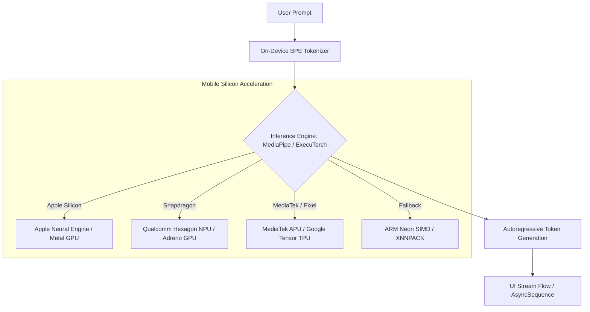

# 🤖 Local LLMs & Small Language Models (SLMs) On-Device

> **Deploying and executing Small Language Models (Gemma 2B, LLaMA 3.2 1B/3B, Phi-3.5) directly on mobile hardware — MediaPipe GenAI Inference API, ExecuTorch, 4-bit quantization, memory bandwidth bottlenecks, and thermal back-off strategies.**

---

## 🎯 1. Why Run LLMs On-Device?

While cloud LLMs (GPT-4o, Claude 3.5 Sonnet, Gemini 1.5 Pro) offer unmatched reasoning capabilities, **on-device SLMs solve four fatal mobile limitations**:

| Vector | Cloud LLM (Server API) | On-Device SLM (Edge) |
|:---|:---|:---|
| **Privacy & Compliance** | User queries leave the device (GDPR, HIPAA, SOC-2 hurdles). | **100% Private**: Data never touches a remote network socket. |
| **Offline Reliability** | Fails completely in airplane mode or low connectivity. | **Always Available**: Operates with 0% network connectivity. |
| **Marginal Cost ($)** | Pay-per-token API bills scale linearly with active users. | **$0 Server Cost**: Inference utilizes the user's mobile chipset. |
| **First-Token Latency** | 300ms–1500ms network round-trip overhead. | **Instant Streaming**: Direct token generation from local NPU/GPU. |



---

## 🧮 2. Quantization & The Memory Bandwidth Bottleneck

The primary bottleneck for LLM inference on mobile devices is **not compute TFLOPs**; it is **Memory Bandwidth (DRAM $\to$ Cache transfer speed)**.

During autoregressive generation, each token generated requires transferring all billions of model weights from mobile LPDDR5 RAM into the processor's SRAM cache.

### The Memory Math: Why 4-bit Quantization is Mandatory

$$\text{Model RAM Footprint} = \text{Parameters} \times \text{Bytes Per Weight}$$

* **FP16 (16-bit Float = 2 Bytes/param)**:
  * LLaMA 3.2 3B = $3 \times 10^9 \times 2 \text{ bytes} \approx \mathbf{6.0 \text{ GB}}$.
  * **Result**: Immediate crash! iOS Jetsam kills any app consuming $>2.5\text{–}3.0\text{ GB}$ of RAM. Android Low Memory Killer (LMK) terminates the background process.
* **INT4 (4-bit Integer = 0.5 Bytes/param with AWQ / GPTQ)**:
  * LLaMA 3.2 1B $\approx \mathbf{650 \text{ MB}}$ RAM.
  * LLaMA 3.2 3B $\approx \mathbf{1.8 \text{ GB}}$ RAM.
  * **Result**: Fits comfortably within mobile RAM limits, leaving headroom for the OS and UI rendering.

```text
Memory Bandwidth Token Generation Formula:
Token Generation Rate (tokens/sec) = Memory Bandwidth (GB/sec) / Model Footprint (GB)

Example on iPhone 16 Pro (LPDDR5X Bandwidth ~60 GB/s, 1.8 GB INT4 Model):
Ideal Peak Generation = 60 / 1.8 ≈ 33 tokens/second.
```

---

## 💻 3. Android Implementation: MediaPipe GenAI LLM Inference (Kotlin)

Google's **MediaPipe GenAI Task library** provides hardware-accelerated LLM execution via Vulkan/OpenCL across Qualcomm, Samsung Exynos, and Google Tensor chips.

```kotlin
import android.content.Context
import com.google.mediapipe.tasks.genai.llminference.LlmInference
import kotlinx.coroutines.channels.awaitClose
import kotlinx.coroutines.flow.Flow
import kotlinx.coroutines.flow.callbackFlow
import java.io.File

class LocalLlmManager(private val context: Context) {

    private var llmInference: LlmInference? = null

    fun initializeModel(modelFile: File) {
        val options = LlmInference.LlmInferenceOptions.builder()
            .setModelPath(modelFile.absolutePath)
            .setMaxTokens(512)
            .setTemperature(0.7f)
            .setTopK(40)
            // Hardware acceleration target (GPU via OpenCL/Vulkan)
            .setPreferredBackend(LlmInference.Backend.GPU)
            .build()

        llmInference = LlmInference.createFromOptions(context, options)
    }

    /**
     * Generates a streaming response for the given user prompt.
     */
    fun generateStreamingResponse(prompt: String): Flow<String> = callbackFlow {
        val inference = llmInference ?: run {
            close(IllegalStateException("LLM Inference engine not initialized"))
            return@callbackFlow
        }

        // Asynchronous streaming callback
        inference.generateResponseAsync(prompt) { partialResult, done ->
            if (partialResult != null) {
                trySend(partialResult)
            }
            if (done) {
                close()
            }
        }

        awaitClose {
            // Cancellation logic if flow collection stops
        }
    }

    fun close() {
        llmInference?.close()
        llmInference = null
    }
}
```

---

## 🍎 4. iOS Implementation: Local Inference via Swift & Metal

On Apple Silicon (A17 Pro, A18, M-Series), on-device models can run directly on the **Apple Neural Engine (ANE)** and **Metal GPU** using Apple's CoreML or ExecuTorch / MLX.

```swift
import Foundation
import MediaPipeTasksGenAI

@MainActor
final class LocalLLMEngine: ObservableObject {
    @Published private(set) var generatedText: String = ""
    @Published private(set) var isGenerating: Bool = false
    
    private var llmInference: LlmInference?

    func loadModel(at modelURL: URL) throws {
        let options = LlmInference.Options(modelPath: modelURL.path)
        options.maxTokens = 512
        options.temperature = 0.7
        options.topK = 40
        
        self.llmInference = try LlmInference(options: options)
    }

    func streamResponse(for prompt: String) -> AsyncThrowingStream<String, Error> {
        AsyncThrowingStream { continuation in
            guard let inference = self.llmInference else {
                continuation.finish(throwing: NSError(domain: "LLM", code: -1, userInfo: [NSLocalizedDescriptionKey: "Model not loaded"]))
                return
            }

            self.isGenerating = true

            do {
                try inference.generateResponseAsync(prompt: prompt) { partialResult, done in
                    if let partialResult = partialResult {
                        continuation.yield(partialResult)
                    }
                    if done {
                        Task { @MainActor in
                            self.isGenerating = false
                        }
                        continuation.finish()
                    }
                }
            } catch {
                continuation.finish(throwing: error)
            }
        }
    }
}
```

---

## 🌡️ 5. Production Constraints: Thermal Throttling & Power Budgets

1. **Thermal Throttling (The "Speed Cliff")**:
   * Running an INT4 model at full load on mobile GPU/NPU draws **3.5W–5W** of power.
   * Mobile devices lack active cooling fans. Within 60–90 seconds of sustained token generation, the chassis temperature reaches thermal trip points ($42^\circ\text{C}$).
   * The OS aggressively throttles SoC clock frequencies by **40%–60%**, dropping generation from 25 tokens/sec to 8 tokens/sec.
   * **Mitigation**: Budget max output tokens (e.g., limit summaries to 150–200 tokens) and implement token streaming pauses between multi-turn interactions.
2. **Zero-Copy Memory Mapping (`mmap`)**:
   * Never read a 1.8GB model file into a byte array in heap memory (`OutOfMemoryError`).
   * Inference engines utilize `mmap()` to map the model weights from flash storage into virtual memory addresses. Weights are paged in directly to the NPU/GPU without heap duplication.
3. **Background Execution Ban**:
   * Mobile operating systems will kill any app running heavy ML inference while in the background. Ensure inference tasks are paused or cancelled when the app transitions into `onStop` / `sceneDidEnterBackground`.

---

## 💡 6. Staff-Level Interview Questions

### Q1: What is the KV Cache in LLM inference, and why does it present a memory challenge on mobile?
> **Answer**: During autoregressive generation, calculating attention for token $N$ requires attention keys and values from all prior tokens $1 \dots N-1$. Rather than recalculating them at every step, the **Key-Value (KV) Cache** stores previous projections in memory. While the model weights have a fixed memory footprint, the **KV Cache grows linearly with context length** ($2 \times \text{layers} \times \text{heads} \times \text{head\_dim} \times \text{context\_len} \times \text{precision}$). On a 4K-token context window, the KV cache can consume several hundred megabytes of precious RAM. On mobile, developers must enforce strict context window limits (e.g., 512 or 1024 tokens) to prevent out-of-memory terminations.

### Q2: Compare ExecuTorch vs MediaPipe GenAI for mobile LLM deployments.
> **Answer**:
> * **ExecuTorch** (Meta): PyTorch's native on-device runtime. Provides fine-grained modularity, supports custom operator kernels, and has native delegate bindings for Apple MPS/Metal, Qualcomm Hexagon QNN, and ARM XNNPACK. Ideal for teams maintaining custom PyTorch architectures.
> * **MediaPipe GenAI** (Google): Turnkey, high-level task-oriented API optimized for Gemma, Falcon, and LLaMA models. It abstracts away kernel binding and delegate selection with built-in Vulkan/OpenCL pipelines, making it faster to integrate for standard text generation tasks with minimal low-level C++ scaffolding.
