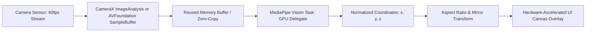
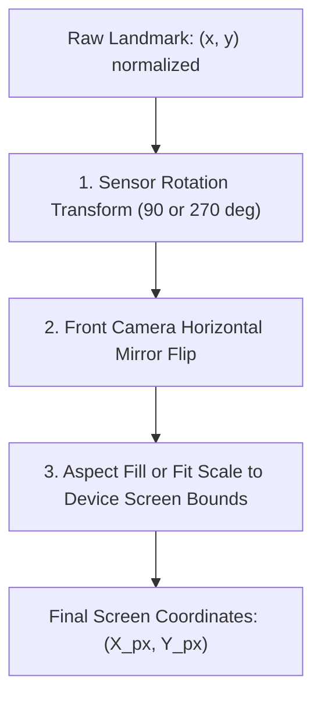

# 👁️ Real-Time Image & Audio Processing with MediaPipe

> **Architecting zero-latency, 60fps on-device computer vision and audio pipelines on Android (CameraX) and iOS (AVFoundation) using Google MediaPipe Tasks — Pose Landmarker, Face Mesh, GPU delegates, and coordinate mapping.**

---

## 🎯 1. The 60fps Real-Time Mobile Vision Pipeline

Processing video frames at 60fps gives an application an exact **16.6-millisecond budget per frame** (or 8.3ms at 120fps). 

If your vision pipeline blocks the UI thread, drops frames, or triggers Garbage Collection (GC) churn via frequent memory allocations, the camera preview will stutter violently.



### The Three Golden Rules of Real-Time Vision Pipelines

1. **Backpressure Strategy (`KEEP_ONLY_LATEST`)**:
   * Never queue camera frames. If the neural network is still analyzing Frame #1, Frame #2 must be dropped immediately so Frame #3 is processed without latency lag.
2. **Zero Allocation in the Frame Loop**:
   * Never allocate a new `Bitmap` or byte array inside `analyze(ImageProxy)`. Reuse a pre-allocated pixel buffer to prevent GC compaction freezes.
3. **GPU Delegate Offloading**:
   * Run inference on the GPU (Metal on iOS, OpenGL ES / Vulkan on Android) to free the CPU for UI rendering and business logic.

---

## 🤖 2. Android CameraX & MediaPipe Pose Landmarker (Kotlin)

### Setup: Pose Landmarker with GPU Acceleration

```kotlin
import android.content.Context
import androidx.camera.core.ImageAnalysis
import androidx.camera.core.ImageProxy
import com.google.mediapipe.framework.image.BitmapImageBuilder
import com.google.mediapipe.framework.image.MPImage
import com.google.mediapipe.tasks.core.BaseOptions
import com.google.mediapipe.tasks.core.Delegate
import com.google.mediapipe.tasks.vision.core.RunningMode
import com.google.mediapipe.tasks.vision.poselandmarker.PoseLandmarker
import com.google.mediapipe.tasks.vision.poselandmarker.PoseLandmarkerResult

class RealtimePoseDetector(
    private val context: Context,
    private val onResultsListener: (PoseLandmarkerResult, MPImage) -> Unit
) : ImageAnalysis.Analyzer {

    private var poseLandmarker: PoseLandmarker? = null

    init {
        setupPoseLandmarker()
    }

    private fun setupPoseLandmarker() {
        val baseOptions = BaseOptions.builder()
            .setModelAssetPath("pose_landmarker_full.task")
            // Crucial: Run on GPU delegate for 60fps real-time inference
            .setDelegate(Delegate.GPU)
            .build()

        val options = PoseLandmarker.PoseLandmarkerOptions.builder()
            .setBaseOptions(baseOptions)
            .setMinPoseDetectionConfidence(0.5f)
            .setMinTrackingConfidence(0.5f)
            .setRunningMode(RunningMode.LIVE_STREAM) // Live stream mode for camera
            .setResultListener { result, inputImage ->
                onResultsListener(result, inputImage)
            }
            .setErrorListener { error ->
                error.printStackTrace()
            }
            .build()

        poseLandmarker = PoseLandmarker.createFromOptions(context, options)
    }

    override fun analyze(imageProxy: ImageProxy) {
        val frameTime = imageProxy.imageInfo.timestamp

        // Convert CameraX ImageProxy to MediaPipe MPImage without memory leak
        val bitmapBuffer = imageProxy.toBitmap()
        val mpImage = BitmapImageBuilder(bitmapBuffer).build()

        // Asynchronous, non-blocking inference
        poseLandmarker?.detectAsync(mpImage, frameTime)

        // Close imageProxy so CameraX can reuse the buffer for the next frame
        imageProxy.close()
    }

    fun close() {
        poseLandmarker?.close()
        poseLandmarker = null
    }
}
```

---

## 🍎 3. iOS AVFoundation & MediaPipe Face Mesh (Swift)

On iOS, we capture `CMSampleBuffer` frames from `AVCaptureVideoDataOutput` and pass `CVPixelBuffer` directly to MediaPipe Tasks using the **Metal GPU Delegate**.

```swift
import AVFoundation
import UIKit
import MediaPipeTasksVision

final class RealtimeFaceMeshDetector: NSObject, AVCaptureVideoDataOutputSampleBufferDelegate {
    
    private var faceLandmarker: FaceLandmarker?
    var onLandmarksDetected: (([NormalizedLandmark]) -> Void)?

    override init() {
        super.init()
        setupFaceLandmarker()
    }

    private func setupFaceLandmarker() {
        guard let modelPath = Bundle.main.path(forResource: "face_landmarker", ofType: "task") else { return }

        let options = FaceLandmarkerOptions()
        options.baseOptions.modelAssetPath = modelPath
        // Offload to Apple Metal GPU
        options.baseOptions.delegate = .GPU
        options.runningMode = .liveStream
        options.numFaces = 1
        options.faceLandmarkerLiveStreamDelegate = self

        do {
            self.faceLandmarker = try FaceLandmarker(options: options)
        } catch {
            print("Failed to initialize FaceLandmarker: \(error)")
        }
    }

    // AVCaptureVideoDataOutput delegate method
    func captureOutput(_ output: AVCaptureOutput, didOutput sampleBuffer: CMSampleBuffer, from connection: AVCaptureConnection) {
        guard let pixelBuffer = CMSampleBufferGetImageBuffer(sampleBuffer) else { return }
        
        let timestamp = CMSampleBufferGetPresentationTimeStamp(sampleBuffer)
        let timestampInMilliseconds = Int(timestamp.seconds * 1000)

        do {
            let mpImage = try MPImage(pixelBuffer: pixelBuffer)
            // Asynchronous non-blocking inference call
            try faceLandmarker?.detectAsync(image: mpImage, timestampInMilliseconds: timestampInMilliseconds)
        } catch {
            print("Inference error: \(error)")
        }
    }
}

extension RealtimeFaceMeshDetector: FaceLandmarkerLiveStreamDelegate {
    func faceLandmarker(
        _ faceLandmarker: FaceLandmarker,
        didFinishDetection result: FaceLandmarkerResult?,
        timestampInMilliseconds: Int,
        error: Error?
    ) {
        guard let landmarks = result?.faceLandmarks.first else { return }
        DispatchQueue.main.async { [weak self] in
            self?.onLandmarksDetected?(landmarks)
        }
    }
}
```

---

## 📐 4. Coordinate Space Transformation

MediaPipe emits landmarks in **normalized coordinates** ($x \in [0.0, 1.0], y \in [0.0, 1.0]$) relative to the unrotated camera sensor orientation. 

Displaying these landmarks over a UI camera preview requires a 3-step geometric transformation:



### Coordinate Mapping Formula (Aspect Fill Mode)

$$\text{Scale} = \max\left(\frac{\text{ViewWidth}}{\text{SensorWidth}}, \frac{\text{ViewHeight}}{\text{SensorHeight}}\right)$$

$$\text{OffsetX} = \frac{\text{ViewWidth} - (\text{SensorWidth} \times \text{Scale})}{2}, \quad \text{OffsetY} = \frac{\text{ViewHeight} - (\text{SensorHeight} \times \text{Scale})}{2}$$

$$\text{ScreenX} = (x_{\text{normalized}} \times \text{SensorWidth} \times \text{Scale}) + \text{OffsetX}$$
$$\text{ScreenY} = (y_{\text{normalized}} \times \text{SensorHeight} \times \text{Scale}) + \text{OffsetY}$$

---

## 🎤 5. Real-Time Audio Classification Pipeline

Beyond vision, MediaPipe provides **Audio Classification Tasks** (e.g., detecting baby crying, glass breaking, speech, alarms) running continuously on low-power microphone buffers.


* **Sample Rate**: Mobile audio models typically expect **16 kHz 16-bit mono PCM**.
* **Audio Clamping**: Ingest microphone buffers into an `AudioData` ring buffer. MediaPipe handles fast Fourier transforms (FFT) and Mel-frequency spectrogram extraction natively before passing tensors to the neural net.

---

## 💡 6. Staff-Level Interview Questions

### Q1: Why does converting `ImageProxy` via `toBitmap()` in Android CameraX cause GC stutter at 60fps, and how do you achieve true zero-copy inference?
> **Answer**: `ImageProxy.toBitmap()` allocates a new Java `android.graphics.Bitmap` object on every frame (60 allocations per second). At 1080p, each uncompressed bitmap is $\approx 8 \text{ MB}$, generating **~480 MB/sec of heap churn**, which immediately triggers ART Concurrent Copying GC and drops frame rates. To achieve zero-copy:
> 1. Use an **OpenGL SurfaceTexture** or **Vulkan Image**. Pass the camera preview texture directly to the MediaPipe GPU delegate via an OpenGL texture ID (`MPImage(textureId)`).
> 2. Alternatively, reuse a single native C++ direct `ByteBuffer` (allocated via `ByteBuffer.allocateDirect()`) and copy the raw YUV planes using native libyuv without touching the managed Java heap.

### Q2: How does MediaPipe achieve 60fps tracking on mobile devices when deep neural network inference usually takes 50–100ms?
> **Answer**: MediaPipe uses a **Detection-Tracking Two-Stage Pipeline**:
> 1. **Detector (Heavy)**: Runs only on the first frame or when the subject is lost. It identifies the bounding box / region of interest (ROI).
> 2. **Tracker / Landmark Estimator (Lightweight)**: For subsequent consecutive frames, MediaPipe uses the previous frame's landmark bounding box to crop a small region and predict new landmark offsets. Running inference on this tiny cropped tensor takes only **3–5 milliseconds**. The heavy detector is re-triggered only if tracking confidence scores fall below a predetermined threshold.
