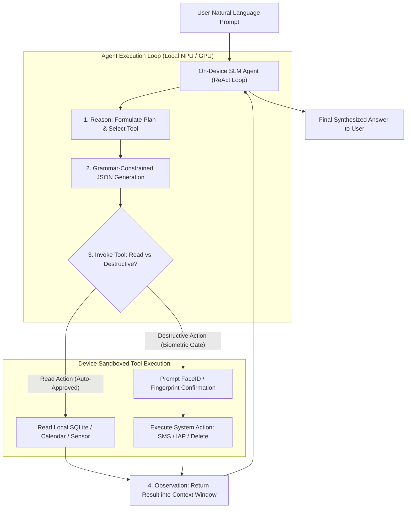
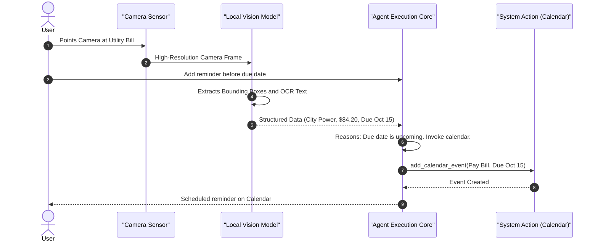

# 🧠 Agentic Mobile Systems: On-Device Function Calling & Multi-Modal Workflows

> **Architecting autonomous, privacy-preserving AI agents on mobile hardware — Small Language Model (SLM) tool-use, Grammar-Constrained JSON decoding, Apple AppIntents / Android system actions, and multi-modal perception loops.**

---

## 🎯 1. Why Agentic Mobile Systems?

Traditional mobile apps are **rigid and reactive**: every user flow requires manually tapping buttons through predetermined navigation hierarchies. 

**Agentic Mobile Systems** shift mobile apps from reactive user interfaces to **proactive goal-oriented execution**:
* The user expresses high-level intent: *"Schedule lunch with Sarah next Tuesday near Central Park and reserve a table."*
* An on-device SLM controller decomposes the goal, queries the local contacts database, inspects the device calendar, checks location availability, and invokes system APIs autonomously.
* **100% On-Device Privacy**: Personal contacts, calendar events, sensor data, and SMS tokens never leave the hardware sandbox.



---

## 🔒 2. Security Architecture & The Tool Permission Matrix

Autonomous agents executing code on a smartphone present serious security risks (e.g., prompt injection attacks tricking an agent into deleting files or exfiltrating data). 

Mobile agent architectures enforce a **Strict Capability & Confirmation Matrix**:

| Capability Tier | Risk Level | Examples | Authorization Policy |
|:---|:---|:---|:---|
| **Tier 1: Read-Only Query** | Low | Reading battery level, fetching upcoming calendar events, searching local Room/SQLite database. | **Silent Execution**: Tool executes immediately without interrupting the user. |
| **Tier 2: Reversible Mutation** | Medium | Creating a calendar draft, setting an alarm, changing local app theme. | **Audited Execution**: Tool executes and displays a passive UI snackbar notification with an "Undo" action. |
| **Tier 3: Irreversible / Financial / External** | Critical | Sending an SMS/Email, authorizing an in-app payment, deleting database records, executing bank transfers. | **Biometric Gate (Mandatory)**: Execution halts until native BiometricPrompt (Android) or LocalAuthentication (FaceID/TouchID on iOS) validates the user's explicit consent. |

---

## 🧮 3. Grammar-Constrained Decoding (Zero-Hallucination JSON)

Standard generative models often hallucinate invalid JSON, invent parameters, or produce trailing Markdown tokens (` ```json `), which will crash native mobile parsers.

Mobile agent engines employ **Grammar-Constrained Decoding (GBNF / Context-Free Grammars)** directly during token generation:


* At each token step, the tokenizer engine evaluates the current state machine against the grammar.
* Tokens violating the JSON Schema (e.g., generating letters when a number or closing brace is expected) have their probability masked to $-\infty$.
* **Result**: **100% mathematically guaranteed valid JSON schema compliance**.

---

## 🤖 4. Native Android Tool Registry & ReAct Loop (Kotlin)

### Step 1: Defining the Typed Tool Contract

```kotlin
import kotlinx.serialization.Serializable
import kotlinx.serialization.json.JsonObject

@Serializable
data class ToolDefinition(
    val name: String,
    val description: String,
    val parametersSchema: String
)

sealed interface ToolResult {
    data class Success(val data: String) : ToolResult
    data class RequiresConfirmation(val prompt: String, val pendingAction: () -> ToolResult) : ToolResult
    data class Failure(val error: String) : ToolResult
}

interface MobileAgentTool {
    val definition: ToolDefinition
    suspend fun execute(parameters: JsonObject): ToolResult
}
```

### Step 2: Implementation of a Device Action Tool

```kotlin
import android.content.Context
import android.provider.CalendarContract
import kotlinx.serialization.json.JsonObject
import kotlinx.serialization.json.jsonPrimitive

class AddCalendarEventTool(private val context: Context) : MobileAgentTool {

    override val definition = ToolDefinition(
        name = "add_calendar_event",
        description = "Schedules a new event in the user's local device calendar.",
        parametersSchema = """{"title": "string", "start_time_epoch": "long", "duration_minutes": "int"}"""
    )

    override suspend fun execute(parameters: JsonObject): ToolResult {
        val title = parameters["title"]?.jsonPrimitive?.content 
            ?: return ToolResult.Failure("Missing event title")
        val startTime = parameters["start_time_epoch"]?.jsonPrimitive?.content?.toLongOrNull() 
            ?: return ToolResult.Failure("Invalid epoch timestamp")

        // Destructive / External action: Enforce User Confirmation
        return ToolResult.RequiresConfirmation(
            prompt = "Schedule '$title' on your calendar?"
        ) {
            // Native Android Calendar Provider write
            ToolResult.Success("Event '$title' scheduled successfully.")
        }
    }
}
```

### Step 3: The Autonomous ReAct Execution Loop

```kotlin
class MobileAgentEngine(
    private val localLlm: LocalLlmManager,
    private val tools: Map<String, MobileAgentTool>
) {
    suspend fun runAgentLoop(userPrompt: String, maxIterations: Int = 5): String {
        val conversationHistory = StringBuilder()
        conversationHistory.append(buildSystemPromptWithTools(tools.values))
        conversationHistory.append("\nUser Goal: $userPrompt\n")

        for (iteration in 1..maxIterations) {
            // 1. Generate next step via on-device SLM
            val response = localLlm.generateBlockingResponse(conversationHistory.toString())
            conversationHistory.append(response).append("\n")

            // 2. Parse tool call from response
            val toolCall = parseToolCall(response) ?: run {
                // No tool call means the agent reached the final answer
                return extractFinalAnswer(response)
            }

            // 3. Resolve and execute tool
            val targetTool = tools[toolCall.toolName] 
                ?: return "Error: Tool '${toolCall.toolName}' is not registered."

            val result = when (val action = targetTool.execute(toolCall.arguments)) {
                is ToolResult.Success -> action.data
                is ToolResult.RequiresConfirmation -> {
                    // Halt for UI biometric/button confirmation
                    action.prompt
                }
                is ToolResult.Failure -> "Tool error: ${action.error}"
            }

            // 4. Feed observation back into context window for next reasoning step
            conversationHistory.append("Observation: $result\n")
        }

        return "Agent halted: Maximum reasoning iterations reached without resolution."
    }

    private fun buildSystemPromptWithTools(toolList: Collection<MobileAgentTool>): String {
        return "You are an on-device personal assistant. Available tools:\n" +
            toolList.joinToString("\n") { "- ${it.definition.name}: ${it.definition.description}" } +
            "\nUse format: Thought: <reasoning>\nAction: {\"tool\": \"<name>\", \"args\": {<params>}}"
    }

    private fun parseToolCall(text: String): ToolInvocation? { /* JSON parser */ return null }
    private fun extractFinalAnswer(text: String): String { return text }

    data class ToolInvocation(val toolName: String, val arguments: JsonObject)
}
```

---

## 🍎 5. Native iOS Agent Tool-Use via Apple AppIntents (Swift 6)

Apple's modern **AppIntents framework** allows on-device SLMs and Siri / Apple Intelligence to invoke structured application capabilities safely with built-in biometric authentication.

```swift
import AppIntents
import Foundation

// 1. Declare structured Tool Intent
struct CreateReminderIntent: AppIntent {
    static var title: LocalizedStringResource = "Create Task Reminder"
    static var description: IntentDescription = "Creates a structured task in the local device reminders database."

    @Parameter(title: "Task Title")
    var title: String

    @Parameter(title: "Priority Level", default: 1)
    var priority: Int

    // Built-in iOS confirmation requirement for mutating actions
    static var parameterSummary: some ParameterSummary {
        Summary("Create reminder '\(\.$title)' with priority \(\.$priority)")
    }

    @MainActor
    func perform() async throws -> some IntentResult & ProvidesDialog {
        // Safe database or EventKit mutation
        let confirmationMessage = "Reminder '\(title)' was saved."
        return .result(dialog: IntentDialog(stringLiteral: confirmationMessage))
    }
}

// 2. Dispatcher for local Agent Controller
final class iOSAgentDispatcher {
    func dispatchToolCall(named name: String, arguments: [String: Any]) async throws -> String {
        switch name {
        case "create_reminder":
            guard let title = arguments["title"] as? String else {
                throw NSError(domain: "Agent", code: -1, userInfo: [NSLocalizedDescriptionKey: "Missing parameter: title"])
            }
            var intent = CreateReminderIntent()
            intent.title = title
            intent.priority = (arguments["priority"] as? Int) ?? 1
            
            let result = try await intent.perform()
            return "Success: Reminder created."
            
        default:
            return "Error: Unknown tool named \(name)"
        }
    }
}
```

---

## 👁️ 6. Multi-Modal On-Device Perception Agents

A Multi-Modal Mobile Agent connects **Camera/Microphone Perception Streams** with **Tool Execution Pipelines**.



---

## ⚠️ 7. Production Engineering Constraints & Pitfalls

1. **Context Window Degradation in Multi-Turn Tool Loops**:
   * Every iterative tool call adds prompt, thought, JSON payload, and observation text into the context window.
   * On mobile, context length is hard-capped (e.g., 2,048 tokens). Exceeding this limit causes OOM memory exhaustion.
   * **Mitigation**: Implement **Observation Pruning**. Truncate raw database or search returns to the top 3 relevant entries before appending to context.
2. **Infinite Reasoning Loops**:
   * If a tool returns an unexpected error format, the model may repeatedly call the same tool with identical invalid parameters.
   * **Mitigation**: Maintain a hash set of `(tool_name, args_hash)` in the active turn. If a tool call is duplicated, inject a hard intervention prompt: *"You have called this tool repeatedly without success. Formulate an alternative approach or ask the user."*
3. **KV-Cache Compaction**:
   * Re-evaluating the entire conversation prompt on every tool turn drains battery and creates high latency.
   * Pre-fill the system prompt and static tool definitions once; only append the new tool observation delta to the existing KV-Cache.

---

## 💡 8. Staff-Level Interview Questions

### Q1: How do you prevent Prompt Injection attacks from hijacking on-device mobile tool execution?
> **Answer**: 
> 1. **Strict Channel Separation**: Never concatenate untrusted external data (e.g., an SMS message or email body) directly into the agent's core instructions without escaping. Wrap all external observations in explicit structured data delimiters (`<user_data> ... </user_data>`).
> 2. **Grammar Enforcement**: Constrain the output space with GBNF grammars so the model can only emit valid tool calls within an approved whitelist.
> 3. **The Biometric Confirmation Perimeter**: The most critical defense is architectural: no destructive tool (sending money, deleting accounts, publishing data) can execute programmatically. The execution layer forces an OS-level confirmation dialog or biometric challenge that cannot be bypassed by LLM token generation alone.

### Q2: Why is fine-tuning a model for Function Calling (e.g., Function Gemma) better than standard Few-Shot Prompting on mobile?
> **Answer**: 
> Standard few-shot prompting requires injecting multiple examples of schemas and tool calls into the prompt on every request, consuming **500–1,000 tokens of the mobile context window** before the user even types a query. On mobile memory budgets (where TTFT — Time-To-First-Token — is constrained by memory bandwidth), every extra 500 prompt tokens adds 300–600ms of pre-fill latency. A fine-tuned function-calling model has internalized tool syntax in its weights, allowing a minimalist prompt and near-instant initial response.
