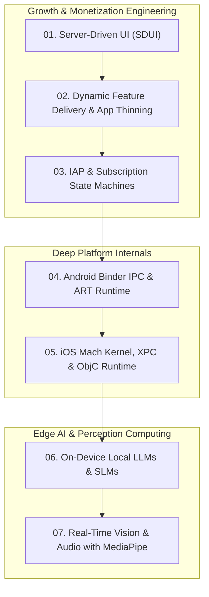

# 🚀 Growth Engineering, Platform Internals & Modern On-Device AI

> **Phase 3 Master Curriculum — Server-Driven UI (SDUI), In-App Purchase Subscription State Machines, Dynamic Feature Delivery, Android Binder/ART Internals, iOS Mach/ObjC Runtime, and On-Device SLMs/MediaPipe.**

---

## 🏛️ Phase 3 Architecture Map

---

## 📑 Curriculum Modules

### 📈 Part I: App Growth & Monetization Engineering
* **[01. Server-Driven UI (SDUI) Frameworks](./01_Server_Driven_UI_SDUI.md)**
  * Schema contracts (JSON/Protobuf), Component registries in Jetpack Compose & SwiftUI, recursive layout parsers, client action handlers, caching, and fallback policies.
* **[02. Dynamic Feature Delivery & App Thinning](./02_Dynamic_Feature_Delivery_and_App_Thinning.md)**
  * Google Play Feature Delivery (install-time, on-demand, conditional), iOS App Thinning (Slicing, Bitcode deprecation, On-Demand Resources ODR), and asset pack management.
* **[03. In-App Purchases & Subscription State Machines](./03_In_App_Purchases_and_Subscriptions.md)**
  * StoreKit 2 vs Google Play Billing 7.0+, full subscription state machine (Grace Period, Account Hold, Paused, Churned), cryptographic receipt validation, and webhook event reconciliation.

---

### 🔬 Part II: Deep Platform Internals
* **[04. Android Binder IPC & ART Runtime Internals](./04_Android_Binder_IPC_and_ART_Internals.md)**
  * Linux IPC vs Android Binder, memory-mapped shared buffer (`mmap`), 1MB transaction buffer limit (`TransactionTooLargeException`), thread pool (max 16), ART vs Dalvik, AOT vs JIT, profile-guided optimization (PGO), and generational GC compaction.
* **[05. iOS Objective-C Runtime, Mach & XPC Internals](./05_iOS_Objective_C_Runtime_and_Mach_Internals.md)**
  * Mach kernel messaging, ports, XPC inter-process communication, `objc_msgSend` trampolines and cache lookups, method swizzling, tagged pointers, autorelease pool pages, and RunLoop execution phases.

---

### 🤖 Part III: On-Device AI & Perception Computing
* **[06. Local LLMs & SLMs on Mobile Devices](./06_Local_LLMs_On_Device.md)**
  * Running Small Language Models (Gemma 2B, LLaMA 3.2 1B/3B, Phi-3.5) on mobile, ExecuTorch, MediaPipe GenAI LLM Inference API, INT4/INT8 quantization, thermal throttling management, and memory-mapped model weights.
* **[07. Real-Time Vision & Audio Processing with MediaPipe](./07_Real_Time_Image_Audio_Processing_MediaPipe.md)**
  * Real-time 60fps Pose Landmarker, Face Mesh, and Hand Gesture detection with CameraX / AVFoundation frame pipelines, GPU delegates, and low-latency audio classification.
