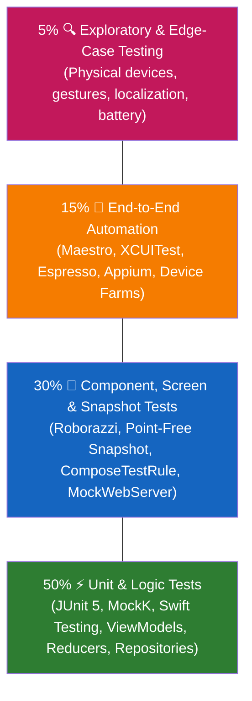
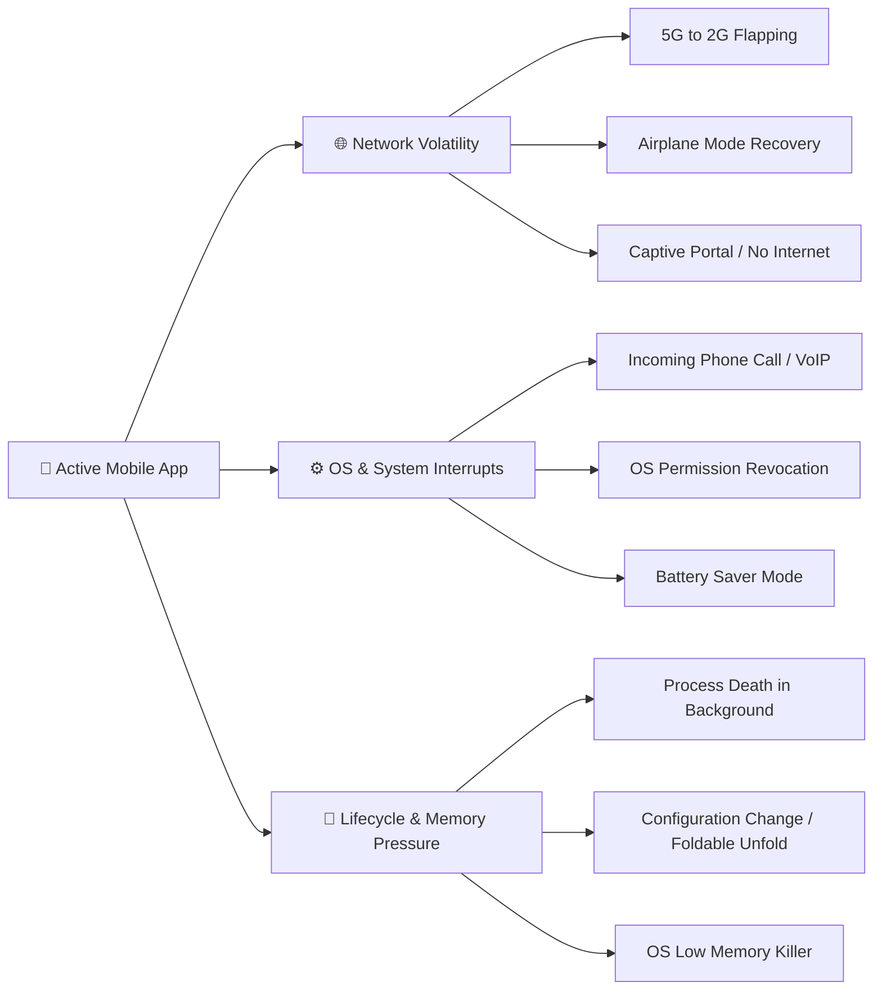
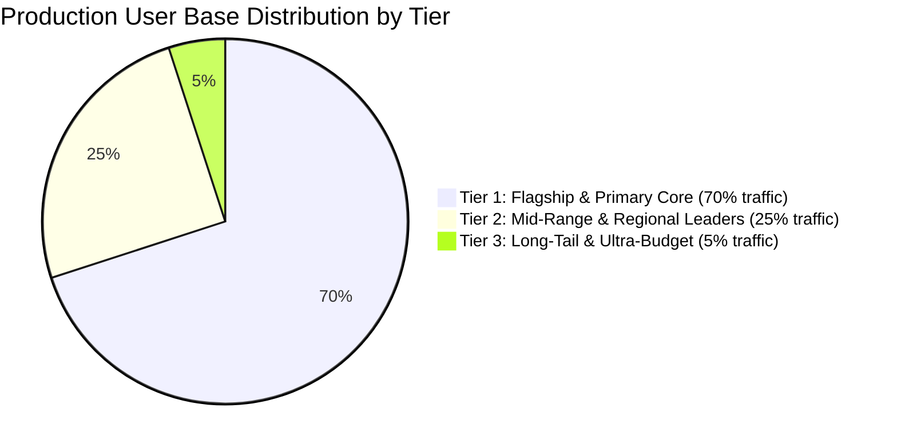
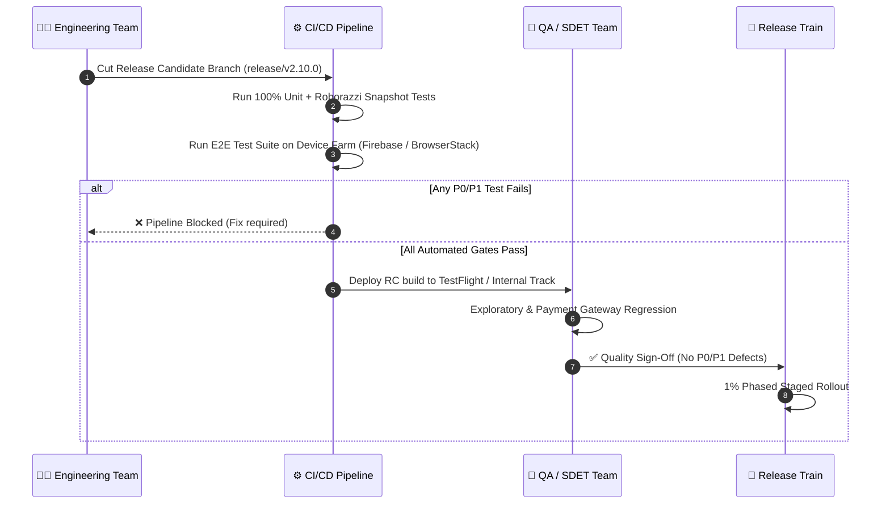

# 📋 Mobile QA Strategy, Testing Pyramid & Release Readiness

> **Enterprise quality engineering playbook for Mobile QA Engineers, SDETs, and Lead Mobile Developers — covering the mobile test pyramid, interruption matrices, fragmentation handling, and release quality gates.**

---

## 🎯 1. The Modern Mobile Testing Pyramid

Unlike backend or web environments where servers are homogeneous and instant rollbacks are possible, mobile applications are distributed binaries running on millions of untrusted, fragmented physical devices.



### The Cost vs. Speed Tradeoff

| Layer | Execution Speed | Maintenance Cost | Flakiness Risk | Target Feedback Loop |
| :--- | :--- | :--- | :--- | :--- |
| **Unit Tests** | ~0.01s per test | Minimal (code-level) | Almost 0% | PR Pre-commit / Pre-push (Local) |
| **Component & Snapshot** | ~0.2s–1s per test | Low to Moderate | Low (< 2%) | PR CI Pipeline (< 5 mins) |
| **E2E Automation** | 15s–60s per flow | High (UI changes) | Medium-High (Network & Animations) | Nightly or Merge to Main (< 30 mins) |
| **Exploratory Testing** | Minutes to Hours | Manual effort | N/A | Release Candidate (RC) Cut |

---

## ⚡ 2. Mobile-Specific Interruption Matrix

Mobile test plans fail most frequently because teams test only the "happy path" on perfect emulators with high-speed Wi-Fi. Production failures stem from **real-world interruptions**.



### 1. Network Transitions & Latency
* **Flapping Network:** Simulate Wi-Fi disconnection mid-upload or mid-checkout. Does the app deadlock, corrupt the local SQLite database, or retry idempotently?
* **High Packet Loss & Throttling:** Test on 2G / 3G with 3000ms latency. Are skeleton loaders displayed? Do cancel buttons respond?
* **Offline-First Synchronization:** Ensure optimistic UI updates correctly write to local storage (Room / CoreData / SwiftData) and synchronize without duplicate entries when connectivity is restored.

### 2. System-Level Interruptions
* **Voice / VoIP Call Interruption:** What happens when an incoming cellular or WhatsApp call occupies the screen during video recording, biometric auth, or payment processing?
* **Backgrounding & OS Termination:**
  * **Android Process Death:** App backgrounded $\rightarrow$ OS kills process to reclaim RAM $\rightarrow$ User returns. Does the app restore state via `SavedStateHandle` without crashing on `NullPointerException`?
  * **iOS Memory Pressure:** Backgrounded app receives `didReceiveMemoryWarningNotification` and gets terminated. Does the app recover cleanly?
* **Permission Revocation at Runtime:** User navigates to OS Settings $\rightarrow$ revokes Camera or Location permission $\rightarrow$ switches back to app. The app must not assume cached permission grants.

---

## 📱 3. Device Fragmentation & Selection Matrix

With over 24,000 unique Android device models and varied iOS hardware profiles, testing on 100% of devices is impossible. Successful teams use a **data-driven 3-tier device matrix**.



### The 3-Tier Testing Matrix Strategy

| Tier | Device Profiles | Primary Test Focus | Execution Cadence |
| :--- | :--- | :--- | :--- |
| **Tier 1 (P0)** | • Apple iPhone 15/16 Pro (iOS Latest)<br>• Samsung Galaxy S23/S24 (OneUI)<br>• Google Pixel 8/9 (Stock Android) | Full E2E Automation, Snapshot Tests, Performance Benchmarking, Biometrics. | Every Pull Request & Merge. |
| **Tier 2 (P1)** | • Apple iPhone 11/12 (Older iOS, Notch)<br>• Xiaomi / Redmi Note (MIUI/HyperOS)<br>• OnePlus / Oppo (OxygenOS / ColorOS) | Background services, OEM aggressive battery kill testing, push notification delivery. | Daily Regression & Release Candidate. |
| **Tier 3 (P2)** | • Android Go / 2GB RAM devices<br>• Foldables (Galaxy Z Fold - unfolding screen sizes)<br>• Tablets (iPad Mini, Galaxy Tab) | Low memory crashes, UI layout clipping, responsive screen resizing, keyboard overlap. | Pre-Release Sign-Off (Manual & Farm). |

---

## 🚦 4. Release Management & Quality Gating

A mature mobile engineering organization relies on strict, automated **Quality Gates** before promoting a Release Candidate (RC) to the App Store or Google Play.



### The Release Sign-Off Checklist (Go / No-Go Criteria)

#### 1. Zero Open P0/P1 Defects
* **P0 (Blocker):** App crash on launch, inability to complete core user journey (Login, Checkout, Streaming playback), data loss.
* **P1 (Critical):** Major feature broken with no feasible workaround, severe performance degradation (> 50% dropped frames), crash occurring on a specific OS version.

#### 2. Performance & Stability Metrics
* **Crash-Free Sessions Threshold:** Minimum **99.85%** crash-free sessions across internal soak tests and beta channels.
* **Crash-Free Users Threshold:** Minimum **99.50%** crash-free users.
* **Cold App Launch Time:**
  * Android: Median startup under **1.8s** (measured via Jetpack Macrobenchmark).
  * iOS: Median startup under **1.5s** (measured via MetricKit / XCTest metrics).
* **Binary Size Guardrail:** Release APK/AAB or IPA increase cannot exceed **+2.0 MB** without Architecture Review Board sign-off.

#### 3. Staged Rollout Strategy
Never release directly to 100% of mobile users. Once an app binary is live, bugs cannot be fixed instantly without an entirely new review cycle.

```text
Day 1: 1% Rollout  ──► Monitor Sentry/Crashlytics (Spike in crashes? Instantly halt)
Day 2: 5% Rollout  ──► Monitor API error rates and customer support tickets
Day 3: 20% Rollout ──► Verify analytics event fidelity and payment conversions
Day 4: 50% Rollout ──► Assess high-concurrency backend load
Day 5: 100% Full Rollout
```

---

## 🛠️ 5. Practical QA & SDET Scenarios in Interviews

### Scenario A: *"How do you test an in-app payment flow with poor network?"*
1. **Mocking & Interception:** Use [Charles Proxy / Proxyman](./06_network_mocking_and_api_testing.md) to inject 500ms–5000ms latency on the payment gateway checkout endpoint (`/v1/charge`).
2. **Double-Tap & Race Conditions:** Rapidly trigger the "Pay Now" CTA to verify button disabling and deduplication keys (`idempotency_key`).
3. **Mid-Flight Disconnection:** Kill network precisely between payment authorization and response acknowledgement. Does the client verify payment status on restart via a polling endpoint, or does it incorrectly prompt the user to pay twice?

### Scenario B: *"How do you ensure UI doesn't break across 50+ languages?"*
1. **Pseudolocalization:** Run UI automation under pseudolocalized locales (e.g., `en-XA` which adds 30–40% longer string lengths like `[!!! Ḽōorem Īpsūum !!!]`).
2. **RTL (Right-to-Left) Testing:** Run automated screenshot/snapshot tests in Arabic (`ar`) or Hebrew (`he`) to detect flipped icons, chevron direction errors, and clipped text in horizontal layouts.

---

[⬅️ Back to Mobile Testing Hub](./README.md)
