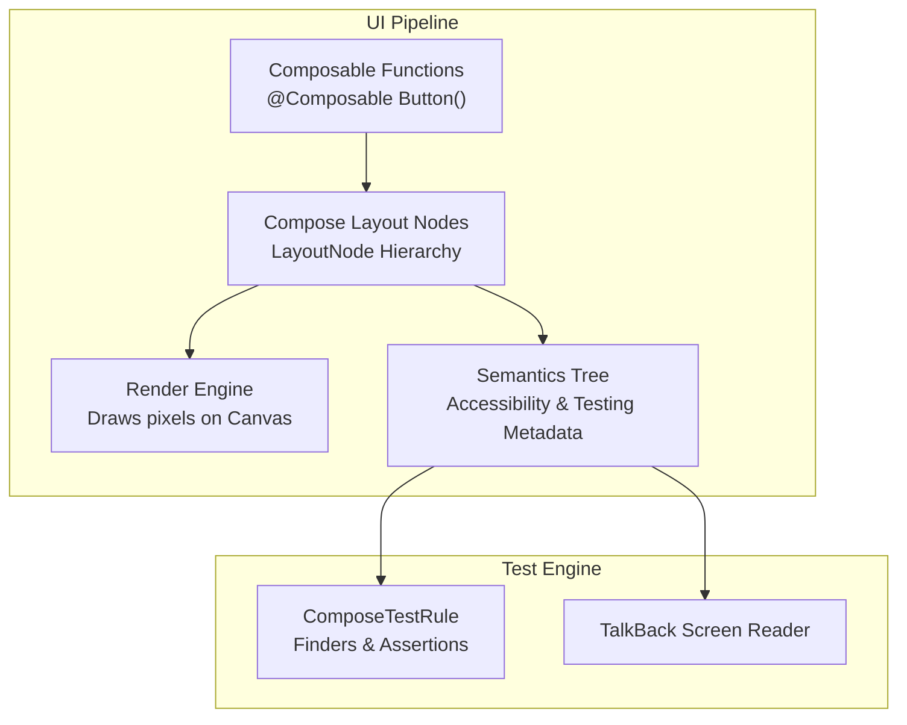
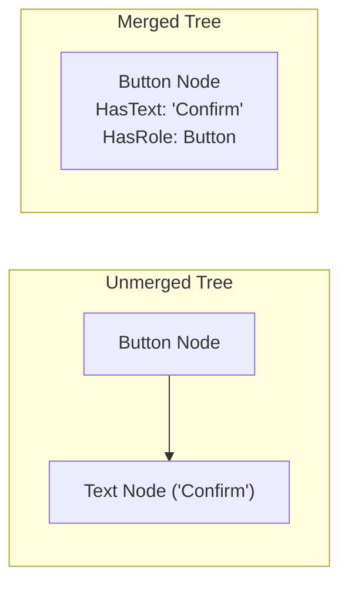
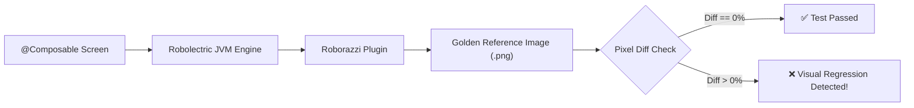

# 🧩 Jetpack Compose UI Testing & Semantics Architecture

> **Complete guide to modern Android UI testing — Semantics Tree, Finders, Actions, Assertions, Animation Clocks, and JVM Screenshot Testing with Roborazzi.**

---

## 🎯 1. The Paradigm Shift: Views vs. Compose Semantics

In legacy Android View testing with Espresso, the framework inspects an **in-memory View hierarchy** (`ViewGroup`, `TextView`, `Button`) via Android reflection and view IDs (`R.id.btn_submit`).

In Jetpack Compose, UI is not built from traditional `View` objects. Composable functions emit layout nodes that are rendered directly onto a single `AndroidComposeView` canvas. Therefore, Compose introduces the **Semantics Tree**:



> **Key Rule:** If a UI component is accessible to assistive technologies (screen readers like TalkBack), it is automatically accessible and testable by Jetpack Compose testing APIs.

---

## 🛠️ 2. Setting Up Test Rules

Depending on whether you are testing an **isolated Composable** or an **entire Activity flow**, choose the appropriate test rule:

```kotlin
// Option A: Isolated Composable Unit/Component Test (Faster, no Activity dependency)
@get:Rule
val composeTestRule = createComposeRule()

// Option B: Full Activity Integration Test (When testing navigation, DI, or Manifest configs)
@get:Rule
val composeTestRule = createAndroidComposeRule<MainActivity>()
```

---

## 🔍 3. The Compose Testing Formula

Every Compose UI test follows a 3-step pipeline:

```text
composeTestRule
    .onNode(FinderMatcher)          // 1. FIND (Locate node in Semantics Tree)
    .perform(Action)                 // 2. ACT (Click, Type, Scroll, Swipe)
    .check(Assertion)                // 3. ASSERT (Verify displayed, text, enabled state)
```

```kotlin
@RunWith(AndroidJUnit4::class)
class LoginScreenTest {

    @get:Rule
    val composeTestRule = createComposeRule()

    @Test
    fun loginFlow_validCredentials_displaysWelcomeMessage() {
        // Given: Render the Composable in isolation
        composeTestRule.setContent {
            MyTheme {
                LoginScreen(
                    onLoginSuccess = { /* mock callback */ }
                )
            }
        }

        // When: Enter credentials and click Submit
        composeTestRule
            .onNodeWithTag("input_email")
            .performTextInput("engineer@example.com")

        composeTestRule
            .onNodeWithTag("input_password")
            .performTextInput("SecretPassword123")

        composeTestRule
            .onNodeWithText("Sign In")
            .performClick()

        // Then: Assert Welcome text appears
        composeTestRule
            .onNodeWithText("Welcome back, engineer!")
            .assertIsDisplayed()
    }
}
```

---

## 🧭 4. Finders: Matching Semantics Nodes

Compose provides specialized finders based on semantics properties:

| Finder | When to Use | Example |
| :--- | :--- | :--- |
| `onNodeWithText("...")` | Visible strings, labels, titles | `composeTestRule.onNodeWithText("Checkout")` |
| `onNodeWithTag("...")` | Dynamic views, custom widgets without text | `composeTestRule.onNodeWithTag("cart_badge")` |
| `onNodeWithContentDescription("...")` | Icon buttons, image content descriptions | `composeTestRule.onNodeWithContentDescription("Back")` |
| `onAllNodesWithTag("...")` | Lists, multiple matching cards in LazyColumn | `composeTestRule.onAllNodesWithTag("product_item")` |

### Setting Test Tags in Production Code
Use `Modifier.testTag("tag_name")`. It only attaches testing metadata to the Semantics node without incurring runtime rendering penalties:

```kotlin
@Composable
fun PrimarySubmitButton(
    text: String,
    onClick: () -> Unit,
    isEnabled: Boolean,
    modifier: Modifier = Modifier
) {
    Button(
        onClick = onClick,
        enabled = isEnabled,
        modifier = modifier.testTag("btn_submit")
    ) {
        Text(text = text)
    }
}
```

---

## 🌲 5. Merged vs. Unmerged Semantics Tree

By default, Compose **merges child semantics into the parent node** for accessibility reasons. For example, a `Button` containing a `Text("Confirm")` node will merge the text into the Button itself.



When you need to interact with a specific child nested inside a clickable container:
```kotlin
// Fails if parent merged the child:
composeTestRule.onNodeWithTag("child_icon").assertExists() 

// Fix: Inspect the unmerged tree directly:
composeTestRule
    .onNodeWithTag("child_icon", useUnmergedTree = true)
    .assertExists()
```

---

## ⏱️ 6. Synchronization & Controlling Animation Clocks

Compose automatically synchronizes with test code: tests will wait for recomposition and layout passes to idle before executing the next assertion.

However, **infinite animations** (like continuous loading spinners or pulsars) will cause tests to hang indefinitely because the UI thread never idles!

### Pausing and Advancing Time Manually:

```kotlin
@Test
fun customCountdownBanner_animatesCorrectly() {
    composeTestRule.setContent {
        CountdownBanner(durationMillis = 5000)
    }

    // 1. Pause the automatic clock advancement
    composeTestRule.mainClock.autoAdvance = false

    // Assert initial state
    composeTestRule.onNodeWithText("Time Remaining: 5s").assertIsDisplayed()

    // 2. Advance time by 3 seconds
    composeTestRule.mainClock.advanceTimeBy(3000)

    // Verify intermediate state
    composeTestRule.onNodeWithText("Time Remaining: 2s").assertIsDisplayed()

    // 3. Complete animation
    composeTestRule.mainClock.advanceTimeBy(2000)
    composeTestRule.onNodeWithText("Expired").assertIsDisplayed()
}
```

---

## 📸 7. Headless Snapshot Testing with Roborazzi

Traditional UI tests require an Android emulator or physical device, taking minutes to run. **Roborazzi** pairs **Robolectric** with Compose to capture **pixel-perfect screenshot tests directly on the host JVM (Mac/Linux CI)** in milliseconds.



### Writing a Roborazzi Screenshot Test:

```kotlin
@RunWith(AndroidJUnit4::class)
@GraphicsMode(GraphicsMode.Mode.NATIVE)
class PaymentSummarySnapshotTest {

    @get:Rule
    val composeTestRule = createComposeRule()

    @Test
    fun paymentSummary_darkTheme_matchesGoldenImage() {
        composeTestRule.setContent {
            AppTheme(darkTheme = true) {
                PaymentSummaryScreen(
                    subtotal = "$140.00",
                    tax = "$12.50",
                    total = "$152.50"
                )
            }
        }

        // Captures screenshot and compares against baseline golden image
        composeTestRule
            .onRoot()
            .captureRoboImage("snapshots/payment_summary_dark.png")
    }
}
```

### Running Roborazzi via Gradle:
```bash
# 1. Record / update baseline golden images
./gradlew recordRoborazziDebug

# 2. Verify on PR CI (Compares against recorded baseline)
./gradlew verifyRoborazziDebug
```

---

## 🏆 Compose Testing Best Practices

1. **Avoid `Thread.sleep()`:** Always rely on Compose's built-in idling or `waitUntil(timeoutMillis) { ... }`.
2. **Inject Test Dispatchers:** Replace background coroutine dispatchers with `StandardTestDispatcher` or `UnconfinedTestDispatcher` so asynchronous data streams settle deterministically.
3. **Prefer Semantic Finders over Arbitrary Tags:** Whenever possible, match against visible text or content descriptions (`onNodeWithText`, `onNodeWithContentDescription`). This guarantees that your tests validate what real users and accessibility services actually see.

---

[⬅️ Back to Mobile Testing Hub](./README.md)
