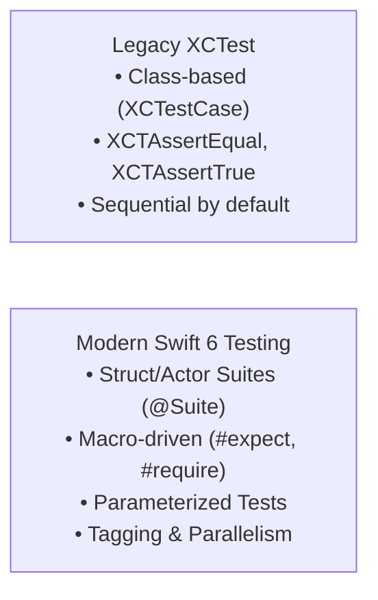

# 🍏 iOS UI Testing: XCUITest, Swift Testing & Snapshot Architecture

> **Complete guide to modern iOS UI and automation testing — XCUITest out-of-process architecture, Accessibility Identifiers, asynchronous waiting, Swift 6 Testing framework, and Snapshot testing.**

---

## 🎯 1. XCUITest Architecture

Unlike Espresso or Robolectric (which run inside the application's process), **XCUITest runs in an isolated runner process** outside the app under test.

```mermaid
graph TD
    subgraph Test Process (Runner)
        TestCode["XCUITest Suite<br/>(XCUIApplication, XCUIElement)"]
    end

    subgraph OS Layer
        XCTestManager["testmanagerd<br/>iOS System Daemon"]
    end

    subgraph Target Application Process
        App["Target iOS App<br/>(UIKit / SwiftUI)"]
        A11yTree["Accessibility Tree<br/>(UIAccessibility)"]
    end

    TestCode -->|"IPC Queries"| XCTestManager
    XCTestManager -->|"Accessibility API"| A11yTree
    A11yTree --> App
    XCTestManager -->|"Simulated Touches & Hardware"| App
```

### Why This Matters:
1. **Black-Box Testing:** The test runner cannot directly access app singletons, ViewModels, or internal Swift objects.
2. **Crash Resilience:** If the application crashes, the test runner stays alive, captures the crash log, and produces diagnostic failure reports.
3. **Accessibility-Driven:** Elements are located strictly through the iOS **Accessibility Tree**.

---

## 🏷️ 2. Accessibility Identifiers vs. Labels

A common mistake in iOS UI testing is locating elements using `accessibilityLabel`.

| Property | Purpose | Localization Impact | Best For |
| :--- | :--- | :--- | :--- |
| **`accessibilityLabel`** | Read aloud by VoiceOver to visually impaired users | Changes per language (`"Sign In"` vs `"Iniciar sesión"`) | **VoiceOver / Accessibility ONLY** |
| **`accessibilityIdentifier`** | Invisible string key used exclusively by test automation | Constant across all languages (`"btn_login"`) | **Automated Testing / SDET** |

### Setting Identifiers in SwiftUI & UIKit:

```swift
// SwiftUI
Button("Checkout") {
    viewModel.processPayment()
}
.accessibilityIdentifier("btn_checkout")

// UIKit
let submitButton = UIButton()
submitButton.accessibilityIdentifier = "btn_submit"
```

---

## 🚀 3. The Core XCUITest Formula

```swift
import XCTest

final class AuthenticationUITests: XCTestCase {
    var app: XCUIApplication!

    override func setUpWithError() throws {
        continueAfterFailure = false
        app = XCUIApplication()
        
        // Pass launch arguments/environment variables for mock data or bypassing animations
        app.launchArguments += ["-UI_TESTING_MODE", "-MOCK_NETWORK"]
        app.launchEnvironment["BASE_URL"] = "http://localhost:8080"
        app.launch()
    }

    override func tearDownWithError() throws {
        app.terminate()
        app = nil
    }

    func testSuccessfulLoginFlow() throws {
        // 1. Locate elements via Accessibility Identifier
        let emailField = app.textFields["input_email"]
        let passwordField = app.secureTextFields["input_password"]
        let loginButton = app.buttons["btn_login"]

        // 2. Wait for screen to appear (Avoid flakiness)
        XCTAssertTrue(emailField.waitForExistence(timeout: 5.0), "Email field did not appear")

        // 3. Perform user actions
        emailField.tap()
        emailField.typeText("ios-engineer@apple.com")

        passwordField.tap()
        passwordField.typeText("SecurePass2026!\n")

        loginButton.tap()

        // 4. Assert destination screen rendered
        let homeNavBar = app.navigationBars["HomeFeed_NavBar"]
        XCTAssertTrue(homeNavBar.waitForExistence(timeout: 8.0))
    }
}
```

---

## ⏱️ 4. Handling Asynchronous UI & Eliminating Flakiness

Never use `Thread.sleep(forTimeInterval:)`. Use expectation-based waiting:

### 1. `waitForExistence(timeout:)`
```swift
let successAlert = app.alerts["Payment_Success"]
XCTAssertTrue(successAlert.waitForExistence(timeout: 5.0))
```

### 2. Predicate Expectations (Dynamic Conditions)
When waiting for an element's label to change (e.g., download progress reaching "Done"):
```swift
let statusLabel = app.staticTexts["sync_status_label"]
let predicate = NSPredicate(format: "label == 'Sync Complete'")

let expectation = XCTNSPredicateExpectation(predicate: predicate, object: statusLabel)
let result = XCTWaiter().wait(for: [expectation], timeout: 10.0)

XCTAssertEqual(result, .completed)
```

### 3. Handling System Permission Dialogs (Interruption Monitors)
iOS system permission popups (Location, Push Notifications, Photos) appear outside the app process. Use an **Interruption Monitor**:

```swift
addUIInterruptionMonitor(withDescription: "Location Permission Alert") { alert in
    let allowButton = alert.buttons["Allow While Using App"]
    if allowButton.exists {
        allowButton.tap()
        return true // Handled
    }
    return false
}

// Trigger an action in the app to make the system prompt register
app.buttons["btn_enable_location"].tap()
app.swipeUp() // A dummy interaction sends an event to flush pending alerts
```

---

## 🧪 5. The Modern Swift 6 Testing Framework

Apple introduced the native **Swift Testing** library in Swift 6 (`import Testing`), offering modern macro-based syntax, parallel test execution, and expressive assertions:



```swift
import Testing
@testable import CoreMobileBanking

@Suite("Account Balance Validation")
struct AccountBalanceTests {

    @Test("Validates positive deposits accurately")
    func depositIncreasesBalance() async throws {
        var account = BankAccount(initialBalance: 100.0)
        try account.deposit(amount: 50.0)
        
        #expect(account.balance == 150.0)
    }

    // Parameterized test across multiple test vectors
    @Test("Validates currency exchange rates", arguments: [
        ("USD", 1.0),
        ("EUR", 0.92),
        ("GBP", 0.78),
        ("JPY", 155.2)
    ])
    func verifyExchangeRates(currency: String, expectedRate: Double) {
        let rate = ExchangeRateService.getRate(for: currency)
        #expect(rate == expectedRate)
    }
}
```

---

## 📸 6. iOS Visual Snapshot Testing (Point-Free)

Visual regression tests capture a rendered SwiftUI view or `UIViewController` as an image and compare it pixel-by-pixel against a baseline golden file.

```swift
import XCTest
import SnapshotTesting
import SwiftUI
@testable import RetailApp

final class ProductCardSnapshotTests: XCTestCase {

    func testProductCard_inLightAndDarkTheme() {
        let view = ProductCardView(
            title: "MacBook Pro M4 Max",
            price: "$3,499.00",
            inStock: true
        )
        let hostingController = UIHostingController(rootView: view)
        hostingController.view.frame = CGRect(x: 0, y: 0, width: 375, height: 200)

        // Light Mode Assertion
        assertSnapshot(
            of: hostingController,
            as: .image(on: .iPhone13Pro),
            named: "product_card_light"
        )

        // Dark Mode Assertion
        assertSnapshot(
            of: hostingController,
            as: .image(on: .iPhone13Pro, traits: .init(userInterfaceStyle: .dark)),
            named: "product_card_dark"
        )
    }
}
```

---

[⬅️ Back to Mobile Testing Hub](./README.md)
