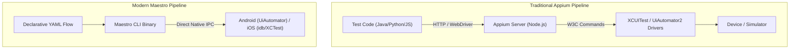

# 🚀 Maestro: Declarative Cross-Platform Mobile UI Automation

> **The modern standard for painless mobile UI automation — why engineering teams are migrating from Appium to Maestro, declarative YAML syntax, deep linking, conditional flows, and CI/CD orchestration.**

---

## 🎯 1. Why Modern Teams Choose Maestro over Appium

For over a decade, **Appium** was the default cross-platform mobile automation framework. However, mobile teams constantly struggled with:
* Complex W3C WebDriver setup (Node.js Appium Server, Appium Java/Python clients, drivers, and adb/Xcode bridges).
* Severe flakiness caused by timing mismatches and asynchronous animations.
* Fragile locator strategies and slow test execution.

**Maestro** is a lightweight, declarative, mobile-first automation tool by Mobile.dev that treats **flakiness-tolerance** as a first-class citizen:



### Head-to-Head Comparison

| Feature | Appium 2.x | Maestro |
| :--- | :--- | :--- |
| **Language** | Java, Python, JS, C# (Imperative) | **Declarative YAML** + JavaScript |
| **Waiting Strategy** | Explicit/Implicit waits (Frequently fails on animations) | **Built-in Automatic Toleration** (Waits for UI to settle) |
| **Setup Overhead** | Node.js, NPM, Appium drivers, environment variables | **Single curl command / binary installation** |
| **Execution Speed** | Slow (multi-hop HTTP wire protocol) | **Fast (Direct daemon communication)** |
| **Maintenance** | High (frequent driver version incompatibilities) | **Low (unified across Android & iOS)** |

---

## 🛠️ 2. Anatomy of a Maestro Flow

Maestro flows are written in human-readable YAML. A single test file works identically on both Android and iOS without code changes:

```yaml
# flows/checkout_flow.yaml
appId: com.example.retailapp
---
- launchApp:
    clearState: true

# 1. Verification of home screen
- assertVisible: "Featured Products"

# 2. Search for product
- tapOn: "Search products..."
- inputText: "Wireless Headphones"
- pressKey: Enter

# 3. Dynamic scrolling until target is visible
- scrollUntilVisible:
    element: "Sony WH-1000XM5"
    direction: DOWN

- tapOn: "Sony WH-1000XM5"

# 4. Add to cart & checkout
- tapOn: "Add to Bag"
- tapOn:
    id: "cart_icon_button"

- assertVisible: "Subtotal: $399.00"
- tapOn: "Proceed to Checkout"

# 5. Final Assertion
- assertVisible: "Payment Method"
```

---

## ⚡ 3. Advanced Maestro Capabilities

### 1. Deep Link Testing (Bypassing 10 Onboarding Screens)
Instead of clicking through login and navigation tabs on every single test, jump directly to the target destination:

```yaml
- openLink: "retailapp://product/sony-wh1000xm5?coupon=SUMMER20"
- assertVisible: "Coupon SUMMER20 applied"
```

### 2. Conditionals & System Permission Popups
Handle permission dialogs that may or may not appear dynamically:

```yaml
# Handle Push Notification prompt if it appears
- runFlow:
    when:
      visible: "Allow.*notifications\\?"
    commands:
      - tapOn: "Allow"
```

### 3. Modular Subflows
Re-use common flows (like authentication) across dozens of regression tests:

```yaml
# flows/subflows/login_helper.yaml
appId: com.example.retailapp
---
- tapOn: "Email"
- inputText: ${USERNAME}
- tapOn: "Password"
- inputText: ${PASSWORD}
- tapOn: "Sign In"
```

Invoking the subflow with parameters from another test:
```yaml
- runFlow:
    file: subflows/login_helper.yaml
    env:
      USERNAME: "qa_tester@company.com"
      PASSWORD: "SecurePassword99!"
```

### 4. Dynamic Data & JavaScript Evaluation
Inject custom logic and runtime random values using inline JavaScript:

```yaml
- evalScript: ${output.randomEmail = "test_" + Date.now() + "@example.com"}
- tapOn: "Enter your email"
- inputText: ${output.randomEmail}
```

---

## ☁️ 4. Running Maestro in CI/CD (GitHub Actions)

Here is a production-grade GitHub Actions workflow running Maestro against an Android emulator:

```yaml
name: Mobile E2E Regression (Maestro)

on:
  pull_request:
    branches: [ main ]

jobs:
  maestro-android-test:
    runs-on: macos-14 # Apple Silicon hardware for fast emulator acceleration
    steps:
      - uses: actions/checkout@v4

      - name: Set up JDK 17
        uses: actions/setup-java@v4
        with:
          distribution: 'zulu'
          java-version: '17'

      - name: Install Maestro CLI
        run: |
          curl -FsSL "https://get.maestro.mobile.dev" | bash
          echo "$HOME/.maestro/bin" >> $GITHUB_PATH

      - name: Build Debug APK
        run: ./gradlew assembleDebug

      - name: Run Android Emulator & Execute Maestro
        uses: reactivecircus/android-emulator-runner@v2
        with:
          api-level: 34
          target: google_apis
          arch: x86_64
          script: |
            maestro test .maestro/flows/
```

---

## 💡 Best Practices for Flawless Maestro Suites

1. **Leverage `clearState: true`:** Ensure tests run from a clean sandbox, preventing cached login credentials from corrupting subsequent tests.
2. **Favor Accessibility IDs over Text:** In multilingual applications, match elements by ID (`id: "submit_btn"`) rather than localized string text.
3. **Use Maestro Cloud for Parallel Matrix Testing:** Upload your build and flows to Maestro Cloud to execute across dozens of physical iOS and Android devices simultaneously in minutes.

---

[⬅️ Back to Mobile Testing Hub](./README.md)
