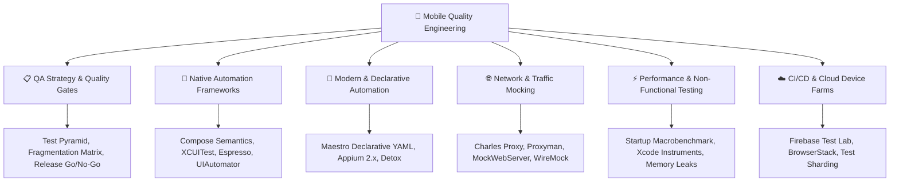

# 🧪 Mobile QA Strategy, Testing & SDET Engineering Handbook

> **The definitive open-source guide to Mobile Quality Assurance, Test Automation Frameworks, and SDET (Software Development Engineer in Test) Engineering for Android, iOS, and Cross-Platform teams.**

---

## 🧭 Why Mobile QA & Testing Is Unique

Testing mobile applications requires a radically different mindset than backend or web testing:
* **Decentralized Binaries:** Once an app binary is published, rollbacks require a multi-day App Store / Play Store review.
* **Extreme Heterogeneity:** Over 24,000+ unique Android device models, OEM battery managers (OneUI, HyperOS), varying screen densities, and notch/Dynamic Island variations.
* **Environmental Volatility:** Cellular dropouts, 5G $\rightarrow$ 2G network flapping, incoming voice calls, background OS process kills, and runtime permission revocations.

---

## 📖 Curated Quality & Automation Guides

### 1. QA Strategy, Matrices & Quality Gating
| Guide | Target Role | Key Topics |
| :--- | :--- | :--- |
| **[Mobile QA Strategy, Test Pyramid & Release Readiness](./01_mobile_qa_strategy_and_test_pyramid.md)** | QA Engineers, SDETs, Tech Leads | Mobile Test Pyramid, Interruption Matrix (Network, VoIP, OS kills), 3-tier device matrix, P0/P1 defect taxonomy, and Staged Rollout Go/No-Go criteria. |

### 2. Native Mobile Automation (Android & iOS)
| Guide | Platform | Scope | Key Topics |
| :--- | :--- | :--- | :--- |
| **[Jetpack Compose UI Testing & Semantics](./02_jetpack_compose_ui_testing.md)** | Android | Modern Native UI | Compose Semantics Tree, `ComposeTestRule`, Finders, Actions, Assertions, Animation Clocks, and JVM Screenshot testing with **Roborazzi**. |
| **[iOS UI Testing: XCUITest & Swift Testing](./03_xcuitest_ios_automation.md)** | iOS | Native iOS | Out-of-process XCUITest architecture, `accessibilityIdentifier`, asynchronous waiting strategies, UI Interruption monitors, Swift 6 `@Test`, and Snapshot testing. |
| **[Espresso UI Testing](./Espresso/01_espresso_guide.md)** | Android | View-Based UI | `onView(matcher).perform(action).check(assertion)`, IdlingResources, and RecyclerView interactions. |
| **[UIAutomator Guide](./UIAutomator/01_ui_automator_guide.md)** | Android | System & Cross-App | System permission dialogues, Notification shade, and cross-application workflows. |
| **[JUnit Testing Guide](./JUnit/01_junit_guide.md)** | Android | Unit Testing | Lifecycle annotations, parameterized tests, Coroutine `runTest`, and assertion libraries. |
| **[Mockito & MockK Guide](./Mockito/01_mockito_guide.md)** | Android | Test Doubles | Stubs, spies, argument captors, and mocking Kotlin coroutines/suspending functions. |

### 3. Cross-Platform & Declarative Automation
| Guide | Framework | Scope | Key Topics |
| :--- | :--- | :--- | :--- |
| **[Maestro Declarative Automation](./04_maestro_declarative_automation.md)** | Android & iOS | Modern E2E Standard | Zero-flakiness YAML flows, automatic animation toleration, deep link testing, subflows, condition handling, and GitHub Actions CI runner. |

---

## ⚡ Framework Comparison: Which One to Choose?

| Criterion | Jetpack Compose / Espresso | XCUITest | Maestro | Appium 2.x |
| :--- | :--- | :--- | :--- | :--- |
| **Primary Platform** | Android | iOS | Android + iOS | Android + iOS + Web |
| **Test Language** | Kotlin | Swift | Declarative YAML | Java, Python, JS, C# |
| **Execution Process** | In-Process (White/Gray-Box) | Out-of-Process (Black-Box) | Out-of-Process CLI | Out-of-Process Client-Server |
| **Speed** | ⚡ Ultra-Fast | 🚀 Fast | 🚀 Fast | 🐢 Moderate to Slow |
| **Flakiness Risk** | Low (Auto-synchronized) | Low-Medium (Requires waiting) | Lowest (Tolerates animations) | High (Prone to timing issues) |
| **Setup Complexity** | Zero (Gradle built-in) | Zero (Xcode built-in) | Minimal (Single CLI binary) | High (Node, Drivers, Appium server) |
| **Cross-App Support** | Limited (Pair with UIAutomator) | Yes | Yes | Yes |

---

## 🎯 Mobile SDET & QA Interview Checklist

When preparing for Senior QA or Mobile SDET interviews (Google, Uber, Amazon, Swiggy, Spotify), ensure you can confidently explain:
1. **Flaky Test Triage:** How to detect, isolate, quarantine, and eliminate non-deterministic tests in CI pipelines.
2. **Device Farm Scaling:** How to shard 500+ mobile test cases across 20 parallel virtual/physical devices in Firebase Test Lab or BrowserStack.
3. **Mocking Strategies:** When to mock in-process (OkHttp `MockWebServer`, `URLProtocol`) vs. network proxy level (Charles/WireMock).
4. **App Startup Benchmarking:** Measuring Cold vs. Hot launch times with Android Macrobenchmark and iOS Time Profiler.
5. **Quality Gating:** The exact quantitative criteria required to halt a staged rollout (Crash-free session rate $< 99.85\%$, ANR spikes).

---

[⬅️ Back to Main Handbook ReadMe](../../README.md)
