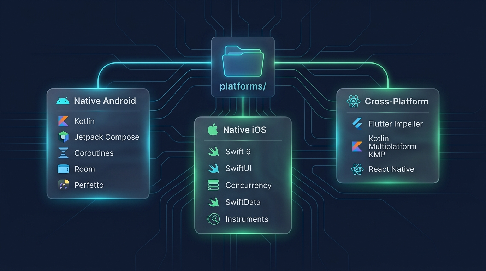

# 📱 Mobile Platform Engineering

> **Complete native and multi-platform engineering curriculum across Android, iOS, and Cross-Platform technologies.**

---

## 🧭 Platforms Directory

| Platform | Curriculum Hub | Description |
| :--- | :--- | :--- |
| **Android Mastery** | **[Android Curriculum](./android/README.md)** | 19 sequential chapters covering Kotlin, Java, Core Components, Jetpack Compose, Architecture, Data, Dependency Injection, Maps, Firebase, Media, Performance, Gradle, and Distribution. |
| **iOS Mastery** | **[iOS Curriculum](./ios/README.md)** | 12 sequential chapters covering Swift, UIKit, SwiftUI, MVVM/Coordinators, Networking, Data Persistence, Concurrency (Swift 6), Testing, Performance, and App Store Distribution. |
| **Android ↔ iOS Bridge** | **[Rosetta Stone Guide](./ios/iOS_for_Android_Developers_Rosetta_Stone.md)** | Direct mental-model translations: Compose vs SwiftUI, Coroutines vs Swift Concurrency, Room vs SwiftData/CoreData, GC vs ARC. |
| **Cross-Platform** | **[Cross-Platform Hub](./cross-platform/README.md)** | Deep-dive guides for **Flutter** (Dart/Impeller), **Kotlin Multiplatform (KMP)**, and **React Native** (New Architecture / JSI). |

---

[⬅️ Back to Master Overview](../README.md)
