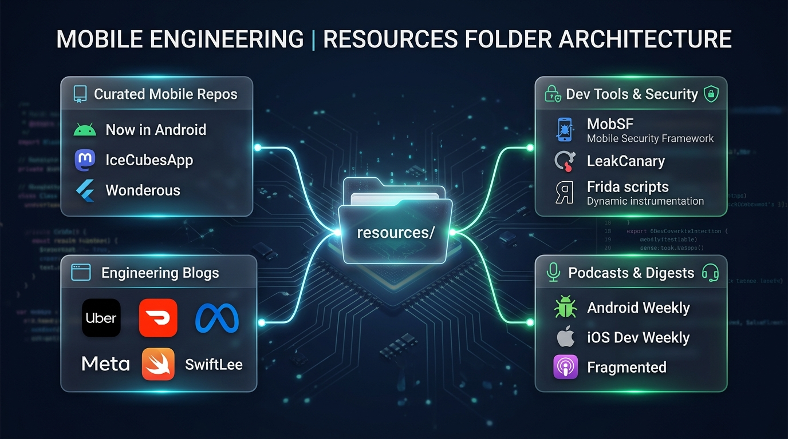
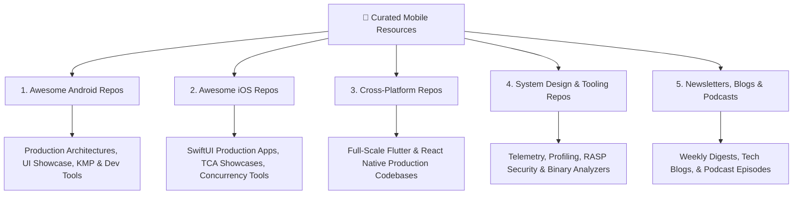

# 🌟 Curated Mobile Engineering Repositories & Essential Resources

> **A hand-picked directory of the world's best open-source mobile repositories, production app architectures, development tools, newsletters, engineering blogs, and podcasts for Android, iOS, Flutter, and React Native developers.**

---



## 🧭 Resource Directory Navigation



---

## 📑 Curated Resource Modules

| Module | Scope | Highlights |
|:---|:---|:---|
| **[📱 01. Awesome Android Repositories](./01-awesome-android-repos.md)** | Android & Kotlin | Now in Android, Tivi, CatchUp, Seal, LeakCanary, Coil, Arrow-KT, Compose Guard. |
| **[🍎 02. Awesome iOS Repositories](./02-awesome-ios-repos.md)** | iOS & Swift | Point-Free TCA, IceCubesApp, Pulse network logger, Kingfisher, SwiftLint, Nuke. |
| **[🌉 03. Awesome Cross-Platform Repositories](./03-awesome-cross-platform-repos.md)** | Flutter & React Native | Wonderous, AppFlowy, Bluesky Social, Expensify/App, Mattermost Mobile. |
| **[📐 04. System Design & Security Repositories](./04-mobile-system-design-and-tooling-repos.md)** | Infrastructure & Tooling | MobSF, OWASP MASTG, Frida-Mobile-Scripts, Emerge Tools, Matrix (Tencent). |
| **[🎙️ 05. Essential Newsletters, Blogs & Podcasts](./05-essential-newsletters-blogs-podcasts.md)** | Continuous Learning | Android Weekly, iOS Dev Weekly, SwiftLee, Uber/DoorDash/Meta Engineering Blogs, Fragmented Podcast. |

---

## 💡 How to Use These Resources
* **Study Real Architectures:** Don't just read tutorials — clone production codebases (like *Now in Android*, *IceCubesApp*, or *Bluesky Social*) to see how multi-module dependency graphs, offline sync, and caching are wired in the real world.
* **Inspect Test Suites:** Examine how top teams write headless Compose/SwiftUI tests, mock network responses, and perform screenshot regression testing.
* **Stay Ahead of Trends:** Subscribe to the curated weekly newsletters to keep track of Android 15/16, Swift 6 concurrency, Kotlin 2.0+, and on-device AI advancements.

---

## 🏆 Strict Curation & Ranking Criteria

Every repository and resource listed in this directory is evaluated against 4 mandatory gates:
1. **🌟 High Community Rating & Star Velocity:** Repositories must have significant adoption (ranging from 1,000 to 75,000+ GitHub Stars).
2. **⚡ Active Maintenance in 2025–2026:** Every codebase has recent commits, active issue triage, and compatibility with modern toolchains (Android Gradle Plugin 8+, Compose Compiler / K2, Swift 6, Flutter 3.24+).
3. **🏛️ Production-Grade Architecture:** Zero toy apps. Only real-world production architectures demonstrating clean multi-module patterns, reactive state management, and offline resilience.
4. **🚫 Zero Deprecated APIs:** No legacy XML-only, RxJava-only, or unmaintained libraries. All resources adhere to modern declarative paradigms.

---

## ⚡ How to Dynamically Add New Repositories

The entire resources directory is powered by a dynamic Python management engine and a single-source-of-truth catalog ([`resources/data/curated_repos.json`](./data/curated_repos.json)).

### 1. Using the CLI Tool:
```bash
# Add or update any repository dynamically (validates live against GitHub REST API):
python3 scripts/sync_resources.py add "owner/repo" \
  --category android \
  --section blueprints \
  --tech "Kotlin / Compose" \
  --desc "Short description of why mobile engineers should study it"
```

### 2. Validating the Catalog:
```bash
# Verify that all linked repositories are active and have no 404 dead links:
python3 scripts/sync_resources.py validate
```

### 3. Rebuilding Markdown Tables:
```bash
# Regenerates all markdown tables with live shields.io star badges:
python3 scripts/sync_resources.py build
```
